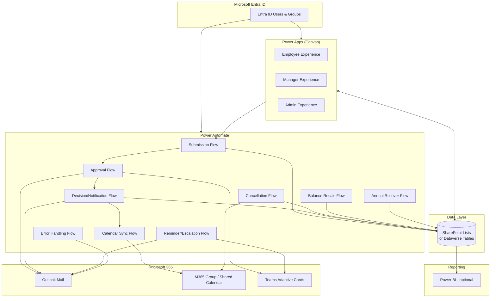
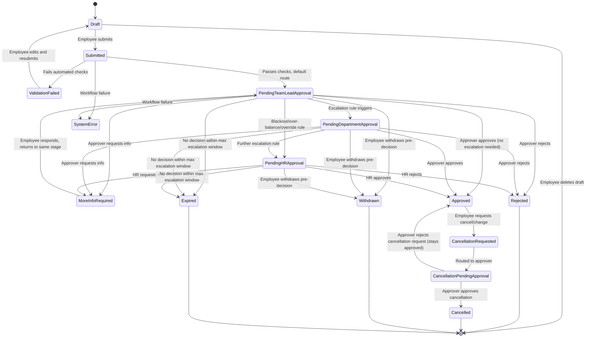
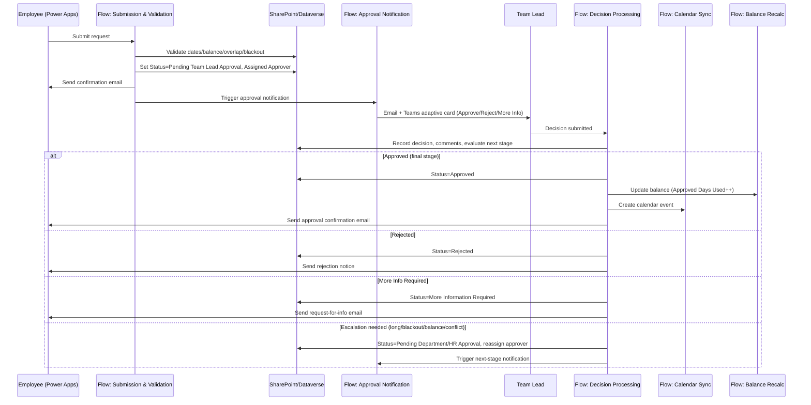
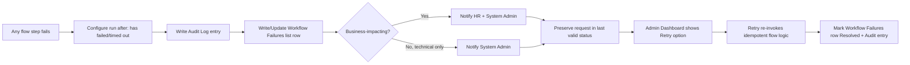
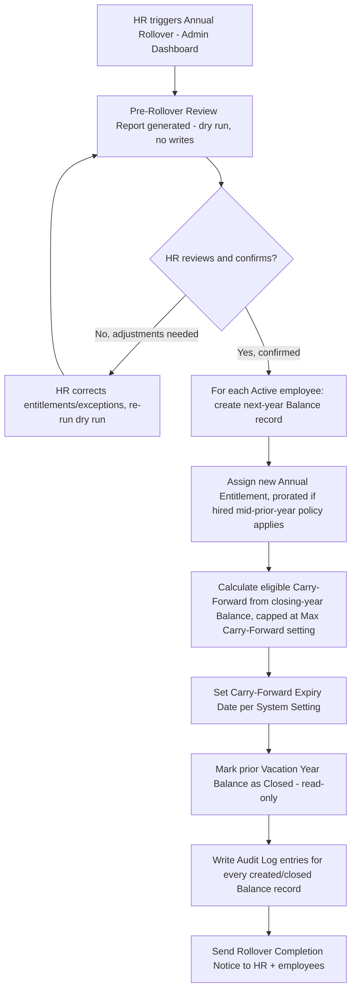

# Vacation Request & Tracking Application — Functional & Technical Blueprint

**Organization size:** ~100 employees
**Platform:** Microsoft 365 / Power Platform
**Audience:** Power Platform developer(s), HR, IT/System Administrators, project sponsor
**Status:** Draft blueprint for review before build begins

> **How to read this document:** Sections are numbered 1–24 per the required deliverable order. Every place a decision had to be made without explicit input from the organization is flagged as **ASSUMPTION** with the reasoning and what would change if the assumption is wrong. These must be confirmed in Phase 1 (Discovery) before development starts.

---

## 1. Executive Summary

This blueprint defines a vacation-request and vacation-tracking system for an organization of ~100 employees, built entirely on the Microsoft 365 / Power Platform stack the organization already owns: **Power Apps** (canvas app) for the user interface, **SharePoint Lists** for the data store (with a defined upgrade path to **Dataverse**), **Power Automate** for approvals/notifications/calendar sync, **Microsoft Entra ID** for authentication, and **Outlook/Microsoft 365 Group calendars** for shared team visibility. Power BI is recommended as an optional add-on for management reporting, layered on top of native Power Apps reports.

**Why Power Platform and not a custom application:** At 100 employees and the described feature set (requests, approvals, balances, calendars, notifications, audit trail, admin console), every requirement in this brief is achievable with standard Power Platform capabilities. There is no requirement here — not volume, not complexity of business logic, not integration need — that requires custom-coded infrastructure (a bespoke database + API + web app). Building custom would cost materially more to build and maintain, would not use the M365 licenses the organization already pays for, and would forfeit Entra ID SSO, Teams integration, and built-in governance that Power Platform provides for free. **Recommendation: build on Power Platform.** (See Section 2 for a scored comparison and the one scenario — very high-volume, sub-second concurrent balance updates — where a custom backend would eventually be justified, which does not apply at this scale.)

**Key design decisions made in this blueprint** (all configurable, not hard-coded):
- Balances are **stored and recalculated by workflow**, not computed live on every screen load (Section 6) — this avoids race conditions and gives an audit trail, at the cost of needing a reliable recalculation flow.
- Approval routing is **rule-driven and table-configured** (Section 9), defaulting to Employee → Primary Team Lead → Final Decision, with escalation branches for blackout periods, balance exceptions, staffing conflicts, and executive requests.
- **Dataverse is recommended over SharePoint Lists** for production if the organization can license it (per-user/per-app Power Apps license); SharePoint Lists is presented as the lower-cost, fully viable alternative with clearly documented limitations (Section 3).
- All permission enforcement happens **at the data layer** (SharePoint item-level permissions or Dataverse security roles), never only by hiding controls in the app.

**What this document contains:** requirements, roles, full data model, balance logic, date-calculation rules, status model, approval matrix, Power Automate architecture, notification matrix and templates, calendar design, screen specs, security model, error handling, reporting plan, annual rollover design, test plan, phased implementation roadmap, risks, open questions, MVP scope, and a future roadmap.

**What this document is not:** it is not code. It is the specification a Power Platform developer (or the person building this in Power Apps Studio) should be able to build directly from, plus the questions that must be answered by HR/leadership before the first list is created.

---

## 2. Recommended Technology Architecture

### 2.1 Architecture overview



### 2.2 Component responsibilities

| Layer | Technology | Responsibility | Notes |
|---|---|---|---|
| Identity | Microsoft Entra ID | Authentication, group membership (Employee/Manager/HR/SysAdmin), conditional access | No separate login system; app uses the signed-in M365 identity automatically |
| Data | SharePoint Lists (or Dataverse) | System of record for employees, requests, balances, config | See Section 3 for the comparison |
| UI | Power Apps Canvas (3 apps or 1 app w/ role-based navigation) | Employee, Manager, Admin experiences | One app with role-gated screens is recommended for 100 users (Section 2.4) |
| Automation | Power Automate (cloud flows) | Validation, routing, email/Teams notifications, calendar sync, reminders, balance updates, rollover | Flows are the *only* place balances/statuses change automatically |
| Calendar | Outlook / M365 Group Calendar | Shared, privacy-safe team visibility | One company calendar with department-tagged categories (Section 13) |
| Reporting | Power BI (optional) + native Power Apps admin reports | Trend/liability/overlap analysis vs. day-to-day operational views | Section 17 splits what belongs where |
| Notifications | Outlook (Power Automate "Send an email") + Teams adaptive cards | Confirmation, approval requests, reminders, escalations | Section 11–12 |

### 2.3 Why not a fully custom application

| Criterion | Power Platform | Custom app (e.g., web app + SQL + API) |
|---|---|---|
| Time to first release | 8–14 weeks (Section 20) | 4–8+ months typical |
| Cost | Uses existing M365/Power Apps licensing; incremental cost is developer time only | New hosting, new auth integration, new CI/CD, ongoing hosting/security patching |
| Authentication | Native Entra ID SSO, no separate identity system to secure | Requires building/maintaining Entra ID app registration, token handling |
| Approvals & email | Power Automate approvals + Outlook connectors, built-in | Must build workflow engine, SMTP integration, retry logic from scratch |
| Calendar | Native Outlook/M365 connectors | Must integrate Microsoft Graph API manually |
| Maintainability | Low-code, maintainable by an internal Power Platform admin | Requires ongoing software engineering resourcing |
| Governance | Inherits M365 tenant DLP policies, Entra Conditional Access | Must build separately |
| Scale ceiling | Comfortable to several thousand users / tens of thousands of records/year with Dataverse | Higher ceiling, irrelevant at 100 employees |

**Conclusion:** at ~100 employees and the workflow complexity described, there is no technical requirement that Power Apps/Power Automate cannot satisfy. A custom build would only be justified if the organization later needed: (a) sub-second concurrent transactional guarantees at high volume (thousands of simultaneous writers), (b) deep custom UI/UX not achievable in Power Apps' canvas/model-driven paradigms, or (c) integration with a non-Microsoft HRIS with no available connector *and* no ability to use Power Automate's HTTP/custom-connector capability (rare — Power Automate can call almost any REST API). None of these apply here. **Recommendation stands: Power Platform.**

### 2.4 One app vs. three apps

**ASSUMPTION:** A single canvas app with role-based navigation (one app, three "modes" — Employee, Manager, Admin — shown/hidden based on the signed-in user's role) is recommended over three separate apps, because:
- Most managers are *also* employees who need to submit their own vacation — a single app avoids app-switching.
- One app is simpler to license, deploy, update, and secure (one app registration, one set of connection references).
- Role-based screens are still fully separable in navigation and security (Section 15) — this is a UI convenience decision, not a security decision. Data-layer permissions are identical either way.

*If the organization prefers strict separation* (e.g., HR wants a completely distinct admin tool not discoverable by employees), three apps sharing the same back end is a valid alternative with marginally more maintenance overhead. This blueprint proceeds with **one app, three role-based experiences**, and Section 14 specifies each "screen set" as if it were independent so the alternative remains a drop-in option.

---

## 3. SharePoint Lists vs. Dataverse Recommendation

### 3.1 Comparison

| Dimension | SharePoint Lists | Microsoft Dataverse |
|---|---|---|
| Licensing cost | Included in existing M365 licenses | Requires Power Apps per-user or per-app license (or Power Apps premium included in some M365/E5 bundles) |
| Row-level / item-level security | Possible but coarse and awkward (item-level permissions break list views/performance at scale, and unique permissions on many items causes list slowdowns) | Native, first-class row-level security via security roles, business units, teams, and field-level security |
| Relationships / referential integrity | Lookup columns only; no enforced foreign keys, no cascading rules, easy to break by editing a list directly | True relationships (1:N, N:N), cascading behaviors, enforced referential integrity |
| Business logic close to data | None (all logic lives in Power Automate/Power Apps) | Business rules, plug-ins, calculated/rollup columns, real-time workflows can live in the platform itself |
| Concurrency / transactional integrity | No native locking; simultaneous updates can overwrite each other (a real risk for balance updates — see Section 6.4) | Optimistic concurrency control built in; better protection against race conditions |
| Scalability | List view threshold (5,000 items) requires indexing/careful view design; workable at ~100 employees × a few hundred requests/year but requires discipline | Designed for large transactional volume, no comparable threshold issue |
| Audit history | Version history per item (manual to query, not query-friendly) | Native, queryable audit log with field-level change tracking |
| Choice/lookup governance | Loosely typed, easy for someone to edit a list schema and break the app silently | Managed schema, solution-based deployment, harder to accidentally break |
| Environments / ALM | Basic (SharePoint site per environment, manual list re-creation or PnP scripts) | Solutions provide proper environment promotion (Dev → Test → Prod) with source control support |
| Reporting via Power BI | Fully supported, slightly less efficient connector | Fully supported, more efficient (native OData/TDS endpoint) |
| Admin familiarity | Very low barrier — most IT admins already know SharePoint | Slightly higher learning curve, more powerful |

### 3.2 Recommendation

**Recommended target state: Dataverse**, because this application's own requirements — item-level privacy of manager comments and balances, an audit log, protection against concurrent balance updates, and durable relationships between Employees/Requests/Balances/Departments — are precisely the scenarios Dataverse is built for and SharePoint Lists handles only with workarounds.

**Practical recommendation given typical licensing:** if the organization already has, or is willing to acquire, Power Apps per-user or per-app plan licensing (or has Microsoft 365 E5 / Power Apps premium entitlements), **build on Dataverse from day one** — it removes several of the security and concurrency workarounds described later in this document (Sections 6.4, 15.7) and the effort difference at build time is modest (a few extra days of table configuration vs. list configuration).

**If premium licensing is not available or approved**, SharePoint Lists is a fully viable Phase 1 platform. This blueprint's schema, flows, and security model are written to work on **either** platform, with the SharePoint-specific mitigations explicitly called out (concurrency locking pattern in 6.4, item-level permission strategy in 15.6–15.7, list-threshold management in 15.6). Migration from SharePoint Lists to Dataverse later is a well-supported path (Power Automate "Move data" templates, or manual export/import) and does not require rebuilding the Power Apps UI from scratch if the data model is kept consistent — column names and list/table structure in Section 5 are deliberately chosen to transfer cleanly.

**ASSUMPTION:** This blueprint assumes **SharePoint Lists as the Phase 1 build platform** (lower cost, no new licensing approval needed), with Dataverse as the recommended Phase 2 migration once volume/security needs justify the license cost. All designs flag where Dataverse changes the answer. *If the organization already owns Power Apps premium licensing, skip straight to Dataverse — every section below still applies, simply substitute "table" for "list" and use Dataverse security roles instead of the SharePoint permission-break workaround in Section 15.*

---

## 4. User-Role and Permission Matrix

### 4.1 Roles

| Role | Description | Typical count |
|---|---|---|
| **Employee** | Every staff member, including managers acting on their own vacation | ~100 |
| **Team Lead / Manager** | Approves requests for their assigned employees | ~10–20 (estimate, confirm in discovery) |
| **Department Manager** | Second-level approver for escalations, longer requests | ~5–10 |
| **HR / Vacation Administrator** | Manages employee records, entitlements, holidays, blackout periods, overrides | 1–3 |
| **System Administrator** | Manages technical platform: flows, connections, environment, logs | 1–2 (IT) |
| **Executive** (special case of Employee) | Routed to a designated executive approver instead of a normal team lead | Varies |

**ASSUMPTION:** These roles map to **Entra ID security groups** (e.g., `VT-Employees` [everyone, via a "membership by default" dynamic group or the whole tenant], `VT-TeamLeads`, `VT-DeptManagers`, `VT-HRAdmins`, `VT-SysAdmins`). Role is *not* a free-text field on the Employee record alone — group membership drives Power Apps/Power Automate permission checks, while the Employee record's "Primary Team Lead," "Secondary Approver," and "HR Administrator" *lookup fields* drive routing (who approves *this specific* employee's request). This dual model (security group = *can they act as a manager at all*; lookup field = *are they responsible for this person*) is what enables the "managers only see their assigned employees" rule.

### 4.2 Permission matrix

Legend: **V**=View, **C**=Create, **E**=Edit, **X**=No access, **V\***=View own/assigned only

| Function / Data | Employee | Team Lead | Dept Manager | HR Admin | Sys Admin |
|---|---|---|---|---|---|
| Own profile (view) | V | V | V | V | V |
| Own profile (edit core HR fields: entitlement, dept, manager) | X | X | X | X | X |
| Own vacation balance | V* (own) | V* (own) | V* (own) | V (all) | X |
| Team members' balances | X | V* (assigned team) | V* (assigned dept) | V (all) | X |
| Submit vacation request | C (own) | C (own) | C (own) | C (any, on behalf of) | X |
| View own request history | V* | V* | V* | V (all) | X |
| Cancel own pending request | E* | E* | E* | E (any) | X |
| Request change/cancel on approved request | C* (creates a change request record) | C* | C* | E (any, direct) | X |
| Approve/reject/request-info on subordinates' requests | X | E* (assigned employees) | E* (assigned dept, escalations) | E (any, override) | X |
| View team calendar (privacy-safe) | V (titles only) | V (titles + own team detail) | V (titles + own dept detail) | V (full detail) | X |
| View manager comments on a decision | X (own request: sees decision comment intended for employee only, not internal notes) | V* (own team) | V* (own dept) | V (all) | X |
| Employee management (add/edit/deactivate) | X | X | X | C/E | X |
| Department/team-lead assignment | X | X | X | E | X |
| Entitlement configuration | X | X | X | E | X |
| Carry-forward/manual balance adjustment | X | X | X | C | X |
| Holidays configuration | X | X | X | E | X |
| Blackout periods configuration | X | X | X | E | X |
| Approval routing rules | X | X | X | E | X |
| Approval delegation setup (own authority) | X | C/E (own delegation) | C/E (own delegation) | E (any, on behalf) | X |
| System settings (business values, e.g. reminder days) | X | X | X | E | X |
| Audit log | X | X | X | V (all) | V (all) |
| Export reports | X | V* (own team, limited) | V* (own dept, limited) | V/Export (all) | X |
| Power Automate flows / connections | X | X | X | X | E |
| Environment variables | X | X | X | X | E |
| SharePoint/Dataverse schema | X | X | X | X | E |
| System logs / failed workflow runs | X | X | X | V (notified of failures affecting their area) | V/E (all) |

**Key exclusions explicitly enforced (from the brief):**
- Employees cannot view another employee's balance, private manager notes, edit approved requests directly, change their own entitlement, or change approval decisions — enforced at the data layer (Section 15), not just hidden UI.
- Managers are scoped to employees where they are listed as `Primary Team Lead` or `Secondary Approver` on the Employee record, or where a `Department` match plus role = Dept Manager applies — never organization-wide by default.
- HR has organization-wide *data* visibility but this blueprint distinguishes HR's **business authority** (entitlements, overrides, holidays) from the System Administrator's **technical authority** (flows, connections, environment variables, logs) — HR does not get Power Automate/maker access; System Admin does not get authority to override a vacation decision or edit entitlements as a business action (they may only do so as a break-glass technical correction, logged and reported to HR — Section 16).

---

## 5. Complete Database Schema

**ASSUMPTION on list vs. table terminology:** written as SharePoint Lists (Section 3). Each field below states Type, Required, Default, Validation, Example, and Visibility (E=Employee, M=Manager, A=HR Admin, S=SysAdmin) using **V**iew/**E**dit/**X**-none.

### 5.1 Employees

| Field | Type | Req'd | Default | Validation | Example | Employee | Manager | HR Admin |
|---|---|---|---|---|---|---|---|---|
| Employee ID | Single line (indexed, unique) | Yes | Auto (EMP-00001) | Unique | EMP-00042 | V | V* | V/E |
| First Name | Single line | Yes | — | Not blank | Priya | V(own) | V*(team) | V/E |
| Last Name | Single line | Yes | — | Not blank | Nair | V(own) | V*(team) | V/E |
| Work Email | Single line | Yes | — | Valid email, unique | priya.nair@org.com | V(own) | V* | V/E |
| M365 User ID (Entra Object ID) | Single line | Yes | — | Valid GUID, unique | 3fa8...-...  | X | X | V/E |
| Employment Status | Choice (Active, On Leave, Terminated) | Yes | Active | Must be valid choice | Active | V(own) | V*(team) | V/E |
| Hire Date | Date | Yes | — | ≤ today | 2022-03-14 | V(own) | V*(team) | V/E |
| Termination Date | Date | No | Blank | ≥ Hire Date | blank | X | X | V/E |
| Department | Lookup → Departments | Yes | — | Must exist in Departments list | Finance | V(own) | V*(team) | V/E |
| Team | Single line / Choice | No | — | — | Payables | V(own) | V*(team) | V/E |
| Job Title | Single line | No | — | — | Staff Accountant | V(own) | V*(team) | V/E |
| Primary Team Lead | Lookup → Employees | Yes | — | Must be Active employee, cannot equal self | EMP-00010 | V(own) | V*(team) | V/E |
| Secondary Approver | Lookup → Employees | No | Blank | Must be Active employee | EMP-00011 | V(own) | V*(team) | V/E |
| HR Administrator | Lookup → Employees | No | Default HR alias | — | EMP-00001 | X | X | V/E |
| Employment Type | Choice (Full-time, Part-time, Contract) | Yes | Full-time | Valid choice | Full-time | V(own) | V*(team) | V/E |
| Work Schedule | Choice (Standard Mon–Fri, Compressed, Custom) | Yes | Standard Mon–Fri | Valid choice | Standard Mon–Fri | V(own) | V*(team) | V/E |
| Standard Workdays | Multi-choice (Mon…Sun) | Yes | Mon–Fri | At least 1 day | Mon,Tue,Wed,Thu,Fri | V(own) | V*(team) | V/E |
| Hours per Workday | Number | Yes | 8 | 0 < x ≤ 24 | 7.5 | V(own) | V*(team) | V/E |
| Vacation Entitlement (days/yr) | Number | Yes | Org default (System Settings) | ≥ 0 | 15 | V(own) | V*(team) | V/E |
| Carry-Forward Amount | Number (rollup from current-year Balance) | No | 0 | ≥ 0, ≤ Max Carry-Forward setting | 3 | V(own) | V*(team) | V (E via adjustment only) |
| Location | Single line | Yes | — | — | Toronto Office | V(own) | V*(team) | V/E |
| Province/Jurisdiction | Choice | Yes | — | Valid choice (drives holiday set) | Ontario | V(own) | V*(team) | V/E |
| Active/Inactive | Yes/No | Yes | Yes | — | Yes | X | X | V/E |
| Created Date | Date/Time (system) | Yes | Now() | — | — | X | X | V |
| Last Modified Date | Date/Time (system) | Yes | Now() | — | — | X | X | V |

### 5.2 Vacation Requests

| Field | Type | Req'd | Default | Validation | Example | Employee | Manager | HR Admin |
|---|---|---|---|---|---|---|---|---|
| Request ID | Single line (unique, indexed) | Yes | Auto (VR-2026-000123) | Unique | VR-2026-000123 | V(own) | V*(team) | V |
| Employee | Lookup → Employees | Yes | Current user | Must be Active | EMP-00042 | V(own) | V*(team) | V |
| Employee Name (cached) | Single line | Yes | From Employee | — | Priya Nair | V | V | V |
| Employee Email (cached) | Single line | Yes | From Employee | Valid email | priya.nair@org.com | V | V | V |
| Department (cached) | Lookup/Text | Yes | From Employee | — | Finance | V | V | V |
| Team Lead (cached, assigned approver at submit time) | Lookup → Employees | Yes | From Employee.Primary Team Lead | Must be Active | EMP-00010 | V | V | V |
| Leave Type | Choice (Vacation, Sick, Personal, Unpaid, Other) | Yes | Vacation | Valid choice | Vacation | V/E(own, draft only) | V | V/E |
| Start Date | Date | Yes | — | ≥ today − configurable grace period; ≤ End Date | 2026-08-10 | V/E(draft) | V | V/E |
| End Date | Date | Yes | — | ≥ Start Date | 2026-08-14 | V/E(draft) | V | V/E |
| Start-Day Duration | Choice (Full, AM Half, PM Half) | Yes | Full | Valid choice | Full | V/E(draft) | V | V/E |
| End-Day Duration | Choice (Full, AM Half, PM Half) | Yes | Full | Valid choice | Full | V/E(draft) | V | V/E |
| Full/Half-Day Selection | Choice (Full Day, Half Day, Hourly) | Yes | Full Day | Valid choice | Full Day | V/E(draft) | V | V/E |
| Total Working Days Requested | Number (calculated, stored) | Yes | Calculated | ≥ 0.5 | 3.5 | V | V | V |
| Total Hours Requested | Number (calculated, stored) | No | Calculated | ≥ 0 | 26.25 | V | V | V |
| Employee Comments | Multi-line text | No | Blank | ≤ 1000 chars | "Family trip" | V/E(draft) | V | V/E |
| Request Status | Choice (see Section 8) | Yes | Draft | Must follow state machine | Pending Team Lead Approval | V | V | V/E |
| Date Submitted | Date/Time | Yes (once submitted) | Now() on submit | — | 2026-07-20 09:14 | V | V | V |
| Current Approval Stage | Choice (Team Lead, Dept Manager, HR, Complete) | Yes | Team Lead | System-set only | Team Lead | V | V | V |
| Assigned Approver | Lookup → Employees | Yes (once submitted) | Routing engine output | Must be Active | EMP-00010 | V | V | V/E (override) |
| Approval Date | Date/Time | No | Blank | — | 2026-07-21 10:02 | V | V | V |
| Decision | Choice (Approved, Rejected, More Info Requested) | No | Blank | System-set from approver action | Approved | V | V | V |
| Approver Comments | Multi-line text | No | Blank | ≤ 1000 chars | "Approved, enjoy!" | V(if decision comment) | V/E(own decisions) | V |
| Cancellation Status | Choice (None, Cancellation Requested, Cancellation Approved, Cancelled) | Yes | None | System-set / HR override | None | V | V | V/E |
| Calendar Event ID | Single line | No | Blank, set by flow | — | AAMk...= | X | X | V |
| Created By | Person (system) | Yes | Current user | — | Priya Nair | V | V | V |
| Created Date | Date/Time (system) | Yes | Now() | — | — | V | V | V |
| Modified By | Person (system) | Yes | Current user/flow | — | Power Automate | X | X | V |
| Modified Date | Date/Time (system) | Yes | Now() | — | — | X | X | V |

**Note on Employee Comments visibility to Team Lead:** shown per Section 4.2 (managers see comments for their own team's requests).
**Note on Approver Comments:** the field is split conceptually into a comment the employee sees (decision rationale) and, if the organization wants truly private internal notes, a separate `Internal Notes` field visible only to Manager/HR (add this in Phase 1 discovery if needed — flagged as an open question in Section 22).

### 5.3 Vacation Balances

| Field | Type | Req'd | Default | Validation | Example | Employee | Manager | HR Admin |
|---|---|---|---|---|---|---|---|---|
| Balance ID | Single line (unique) | Yes | Auto (BAL-EMP00042-2026) | Unique per Employee+Year | BAL-EMP00042-2026 | X | X | V |
| Employee | Lookup → Employees | Yes | — | Must be Active or Terminated (historical) | EMP-00042 | V(own) | V*(team) | V |
| Vacation Year | Number/Choice | Yes | Current year | 4-digit year | 2026 | V(own) | V*(team) | V/E |
| Annual Entitlement | Number | Yes | From Employee record at rollover | ≥ 0 | 15 | V(own) | V*(team) | V |
| Carry-Forward | Number | Yes | 0 | ≥ 0, ≤ Max Carry-Forward | 3 | V(own) | V*(team) | V/E |
| Manual Credits | Number | Yes | 0 | ≥ 0 | 1 | V(own) | V*(team) | V (via Balance Adjustments) |
| Manual Deductions | Number | Yes | 0 | ≥ 0 | 0 | V(own) | V*(team) | V (via Balance Adjustments) |
| Approved Days Used | Number (recalculated by flow) | Yes | 0 | ≥ 0 | 4.5 | V(own) | V*(team) | V |
| Pending Days | Number (recalculated by flow) | Yes | 0 | ≥ 0 | 2 | V(own) | V*(team) | V |
| Remaining Days | Number (recalculated by flow) | Yes | = Entitlement + Carry-Forward | See Section 6 formula | 13.5 | V(own) | V*(team) | V |
| Expiry Date for Carried-Forward Time | Date | No | System Setting default | ≥ Vacation Year start | 2026-06-30 | V(own) | V*(team) | V/E |
| Last Recalculated Date | Date/Time (system) | Yes | Now() | — | — | X | X | V |

### 5.4 Departments

| Field | Type | Req'd | Default | Validation | Example | Employee | Manager | HR Admin |
|---|---|---|---|---|---|---|---|---|
| Department ID | Single line (unique) | Yes | Auto | Unique | DEPT-04 | V | V | V/E |
| Department Name | Single line | Yes | — | Unique | Finance | V | V | V/E |
| Department Manager | Lookup → Employees | Yes | — | Active employee | EMP-00005 | V | V | V/E |
| Default Approver | Lookup → Employees | Yes | = Department Manager | Active employee | EMP-00005 | X | V | V/E |
| Backup Approver | Lookup → Employees | No | Blank | Active employee | EMP-00006 | X | V | V/E |
| Minimum Staffing Requirement | Number (headcount or %) | No | System Setting default | ≥ 0 | 3 | X | V | V/E |
| Maximum Employees Away Simultaneously | Number | No | System Setting default | ≥ 0 | 2 | X | V | V/E |
| Active/Inactive | Yes/No | Yes | Yes | — | Yes | X | X | V/E |

### 5.5 Holidays

| Field | Type | Req'd | Default | Validation | Example | Employee | Manager | HR Admin |
|---|---|---|---|---|---|---|---|---|
| Holiday Name | Single line | Yes | — | Not blank | Civic Holiday | V | V | V/E |
| Date | Date | Yes | — | Unique per Location | 2026-08-03 | V | V | V/E |
| Location/Jurisdiction | Choice/Lookup | Yes | All | Valid choice | Ontario | V | V | V/E |
| Paid/Unpaid | Choice | Yes | Paid | Valid choice | Paid | X | V | V/E |
| Active/Inactive | Yes/No | Yes | Yes | — | Yes | X | X | V/E |
| Excluded from Vacation Calculation | Yes/No | Yes | Yes | — | Yes | X | X | V/E |

### 5.6 Blackout Periods

| Field | Type | Req'd | Default | Validation | Example | Employee | Manager | HR Admin |
|---|---|---|---|---|---|---|---|---|
| Name | Single line | Yes | — | Not blank | Year-End Close | V | V | V/E |
| Start Date | Date | Yes | — | ≤ End Date | 2026-12-15 | V | V | V/E |
| End Date | Date | Yes | — | ≥ Start Date | 2027-01-05 | V | V | V/E |
| Department | Lookup → Departments (blank = all) | No | Blank (all) | Must exist if set | Finance | V | V | V/E |
| Location | Choice (blank = all) | No | Blank (all) | — | All | V | V | V/E |
| Reason | Multi-line text | No | Blank | — | "Year-end financial close" | V | V | V/E |
| Requests Blocked or Only Warned | Choice (Blocked, Warn Only) | Yes | Warn Only | Valid choice | Blocked | X | V | V/E |
| Exception Approver | Lookup → Employees | No | HR default | Active employee | EMP-00001 | X | V | V/E |

### 5.7 Approval Delegations

| Field | Type | Req'd | Default | Validation | Example | Employee | Manager | HR Admin |
|---|---|---|---|---|---|---|---|---|
| Original Approver | Lookup → Employees | Yes | Current user (self-service) | Must be a Team Lead/Manager | EMP-00010 | X | V/E(own) | V/E |
| Delegate Approver | Lookup → Employees | Yes | — | Active employee, ≠ Original Approver | EMP-00011 | X | V/E(own) | V/E |
| Start Date | Date | Yes | Today | ≤ End Date | 2026-08-01 | X | V/E(own) | V/E |
| End Date | Date | Yes | — | ≥ Start Date | 2026-08-14 | X | V/E(own) | V/E |
| Departments/Teams Covered | Multi-choice/Lookup | No | Original Approver's own team | — | Finance | X | V/E(own) | V/E |
| Active/Inactive | Yes/No (calculated from dates, can be manually revoked) | Yes | Yes | — | Yes | X | V(own) | V/E |

### 5.8 Balance Adjustments

| Field | Type | Req'd | Default | Validation | Example | Employee | Manager | HR Admin |
|---|---|---|---|---|---|---|---|---|
| Adjustment ID | Single line (unique) | Yes | Auto | Unique | ADJ-000045 | X | X | V |
| Employee | Lookup → Employees | Yes | — | Active or Terminated | EMP-00042 | V(own, result only) | X | V/E |
| Vacation Year | Number | Yes | Current year | Valid year | 2026 | V(own) | X | V/E |
| Adjustment Type | Choice (Credit, Deduction, Correction) | Yes | — | Valid choice | Credit | X | X | V/E |
| Amount | Number | Yes | — | ≠ 0 | +2 | X | X | V/E |
| Reason | Multi-line text | Yes | — | Not blank | "Manual correction — missed holiday credit" | X | X | V/E |
| Administrator | Lookup → Employees (system, current user) | Yes | Current user | Must be HR Admin role | EMP-00001 | X | X | V |
| Date | Date/Time (system) | Yes | Now() | — | — | X | X | V |
| Supporting Notes | Attachment/text | No | Blank | — | Email approval attached | X | X | V/E |

### 5.9 Audit Log

| Field | Type | Req'd | Default | Validation | Example | Employee | Manager | HR Admin |
|---|---|---|---|---|---|---|---|---|
| Audit ID | Single line (unique) | Yes | Auto | Unique | AUD-00001234 | X | X | V |
| Record Type | Choice (Request, Balance, Employee, Delegation, Setting, etc.) | Yes | — | Valid choice | Request | X | X | V |
| Record ID | Single line | Yes | — | Must reference an existing/former record | VR-2026-000123 | X | X | V |
| Action | Choice (Created, Updated, Approved, Rejected, Cancelled, Adjusted, System Error, etc.) | Yes | — | Valid choice | Approved | X | X | V |
| Previous Value | Multi-line text (JSON snapshot) | No | Blank | — | `{"status":"Pending Team Lead Approval"}` | X | X | V |
| New Value | Multi-line text (JSON snapshot) | Yes | — | — | `{"status":"Approved"}` | X | X | V |
| Performed By | Person (or "System"/flow name) | Yes | Current user/flow | — | Power Automate – ApprovalFlow | X | X | V |
| Date and Time | Date/Time (system) | Yes | Now() | — | 2026-07-21 10:02:14 | X | X | V |
| Workflow Run ID | Single line | No | From flow run context | — | 08585xxxxxxxxxxxxxxxxxxxxxxxxxxxxxxxxxx | X | X | V |
| Reason/Comments | Multi-line text | No | Blank | — | "Auto-recalc after cancellation" | X | X | V |

**Write-once design:** the Audit Log list should have **Add-only** item permissions (no Edit/Delete) enforced at the list-permission level so even an HR Admin cannot silently rewrite history — corrections are new audit rows, never edits to old ones.

### 5.10 System Settings

Single list, one row per setting (key/value/type), or a small fixed-schema list. Recommended key/value structure for flexibility:

| Field | Type | Req'd | Default | Validation | Example |
|---|---|---|---|---|---|
| Setting Key | Single line (unique) | Yes | — | Unique | `ApprovalReminderDays` |
| Setting Value | Single line | Yes | — | Type-checked by flow at read time | `2` |
| Data Type | Choice (Number, Text, Date, Boolean, Email) | Yes | — | — | Number |
| Description | Multi-line text | No | — | — | "Business days before first reminder to approver" |
| Category | Choice (Approval, Balance, Calendar, Notification, Format) | Yes | — | — | Approval |
| Last Modified By / Date | Person / Date-time | Yes | System | — | — |

Example rows to seed:

| Setting Key | Example Value |
|---|---|
| ApprovalReminderDays (1st reminder) | 2 |
| ApprovalReminderDays2 (2nd reminder) | 4 |
| ApprovalEscalationDays | 5 |
| MaxCarryForwardDays | 5 |
| CarryForwardExpiryDate | June 30 following rollover |
| DefaultWorkdayHours | 8 |
| CompanyCalendarGroupId | (M365 Group GUID) |
| HRNotificationEmail | hr@org.com |
| SystemAdminNotificationEmail | it-helpdesk@org.com |
| EmailSenderAddress | vacationsystem@org.com (shared mailbox) |
| BalanceExceptionApprovalThreshold | 0 (i.e., any request exceeding balance requires HR) |
| LongRequestDeptApprovalThresholdDays | 5 |
| StaffingConflictApprovalRequired | Yes |
| BackdatedSubmissionAllowed | Yes (with HR notice) |
| CancellationRequestWindowDays | Any time before start date; after start date requires HR |
| DateFormat | DD-MMM-YYYY |
| TimeZone | Eastern Standard Time |

---

## 6. Vacation-Balance Calculation Design

### 6.1 Core formula

```
Current Available Balance =
      Annual Entitlement
    + Approved Carry-Forward
    + Manual Credits
    − Manual Deductions
    − Approved Vacation Used

Pending Vacation (tracked separately, never netted into "Current Available Balance") =
      SUM(Total Working Days Requested WHERE Request Status IN
          ["Submitted","Pending Team Lead Approval","Pending Department Approval",
           "Pending HR Approval","More Information Required"])

Projected Balance If All Pending Approved =
      Current Available Balance − Pending Vacation
```

### 6.2 Values displayed to the employee

| Displayed value | Source |
|---|---|
| Annual Entitlement | Balances.Annual Entitlement (current Vacation Year) |
| Carry-Forward | Balances.Carry-Forward |
| Approved Vacation Used | Balances.Approved Days Used |
| Pending Requested Vacation | Balances.Pending Days |
| Current Available Balance | Balances.Remaining Days |
| Projected Balance if All Pending Approved | Remaining Days − Pending Days (calculated in the app, not stored) |

### 6.3 Stored vs. dynamic vs. hybrid — recommendation

**Recommendation: hybrid, balance-weighted toward "stored."**

- The **Vacation Balances** list holds the authoritative, stored `Approved Days Used`, `Pending Days`, and `Remaining Days` fields per employee per year.
- These stored fields are updated **only by Power Automate flows**, triggered by specific events (submission, approval, rejection, cancellation, date change, manual adjustment) — never by user edit, never by a Power Apps formula writing directly to the balance.
- The **Employee Dashboard** and **Request Form** read the stored balance directly (fast, no recalculation needed on every screen open) and compute the *projected* balance live in the app (`Remaining Days − Pending Days`), since that number is a simple derived display value, not something that needs to persist.
- A separate **Balance Recalculation flow** (Section 10) can be run on demand by HR (button in Admin Dashboard) or nightly on a schedule as a **reconciliation safety net** — it recomputes each employee's balance from first principles (sum of approved/pending requests + adjustments) and compares it to the stored value; if they differ, it corrects the stored value and writes an Audit Log entry flagged `Discrepancy Corrected`. This catches any drift caused by a partially-failed flow.

**Why not fully dynamic (compute on every page load)?** Recomputing "sum all approved requests since hire date" live, on every dashboard load, for every user, adds latency, and — more importantly — makes it impossible to "close" a vacation year (Section 18) since a historical year's balance must never move once closed. Stored per-year balances with periodic reconciliation gets the reliability of dynamic calculation without the performance and immutability problems.

**Why not fully stored with no reconciliation?** Because SharePoint Lists has no native transaction/locking mechanism (Section 3), a purely stored approach is vulnerable to two flows updating the same record concurrently and one overwrite silently winning. The reconciliation job is the safety net for that gap (see 6.4 below for the primary mitigation).

### 6.4 Preventing concurrency and correctness problems

| Risk | Mitigation |
|---|---|
| **Double deductions** (a request counted twice) | Balance is only ever adjusted by a flow reacting to a specific `Request Status` **transition** (e.g., → Approved), not by a recurring scan that might re-process the same request. Each flow run stamps the Request record with a `Balance Applied` flag/timestamp; the update flow checks this flag first and exits if already applied (idempotency check) before writing to Balances. |
| **Duplicate requests** (same employee, overlapping dates, submitted twice — e.g., double-click or two tabs) | Submission flow checks for an existing **non-cancelled, non-rejected** request for the same employee with overlapping date ranges *before* creating a new record; if found, the flow halts and returns a "You already have a request for these dates (VR-####)" message to the app instead of creating a second record. |
| **Two workflows updating the same balance simultaneously** (e.g., an approval and a cancellation racing) | (a) Use Power Automate's **"Get item" + "Update item" with an `If-Match`/ETag check** where the platform supports it (Dataverse does this natively via optimistic concurrency; SharePoint Lists needs pattern (b)). (b) On SharePoint, serialize all balance writes through a **single flow with concurrency control set to 1** ("Concurrency Control" run setting on the trigger, degree of parallelism = 1) so only one instance of the balance-updating flow executes at a time per environment; other flows that need a balance changed don't write directly — they instead add a row to a lightweight **"Balance Update Queue"** list (or call the balance flow as a child flow) which the single-threaded flow drains sequentially. This avoids two simultaneous writers entirely. |
| **Incorrect totals when an approved request is cancelled** | Cancellation is never a raw delete. It moves the request to `Cancellation Pending Approval` → `Cancelled`, and the balance-recalc flow re-adds the previously-deducted days back to `Remaining Days` and subtracts from `Approved Days Used`, logging the delta in the Audit Log. The flow reads the *previous* stored `Total Working Days Requested` on the request record (not a fresh date calculation) to guarantee the reversal matches exactly what was originally deducted, even if holiday/date-calc rules change later. |
| **Incorrect totals when dates are changed** | An approved request is never edited in place. A change request creates a linked "modification" record; on approval of the modification, the flow reverses the original day count and applies the new day count as two explicit, audited steps — never a silent overwrite. |
| **Negative balances unless specifically authorized** | The submission validation flow blocks submission (status → `Validation Failed`) if `Total Working Days Requested > Remaining Days`, *unless* System Setting `BalanceExceptionApprovalThreshold` allows over-balance requests to route to HR for authorization (Section 9) — in which case the request proceeds but is flagged and requires explicit HR approval before any balance goes negative. |
| **Historical balances changing after the vacation year closes** | Once a Vacation Year's Balance record is marked `Closed` (Section 18, annual rollover), the Balance Recalculation flow explicitly excludes closed years from any automated recompute, and Power Apps forms make the Balance record read-only for closed years (enforced by a "closed year" check in the form's `OnSave`, backed by SharePoint list validation/column-level permission where feasible). Any correction to a closed year requires a new **Balance Adjustment** row referencing that year (not an edit to the closed Balance record itself), preserving the historical figure while allowing HR to book a correction. |

### 6.5 Pseudocode — balance update on approval

```
TRIGGER: VacationRequests.RequestStatus changes to "Approved"
  (Power Automate flow, concurrency control = 1 for this trigger)

IF Request.BalanceApplied == true:
    EXIT  // idempotency guard, already processed

balance = GET Balances WHERE Employee = Request.Employee AND VacationYear = YEAR(Request.StartDate)

IF balance.IsClosed == true:
    LOG error to Audit Log ("Attempted balance update on closed year")
    NOTIFY HR Admin
    EXIT

balance.ApprovedDaysUsed += Request.TotalWorkingDaysRequested
balance.PendingDays -= Request.TotalWorkingDaysRequested   // moves from pending to used
balance.RemainingDays = balance.AnnualEntitlement + balance.CarryForward
                        + balance.ManualCredits - balance.ManualDeductions
                        - balance.ApprovedDaysUsed

UPDATE Balances SET balance
UPDATE Request SET BalanceApplied = true, ModifiedDate = now()

WRITE AuditLog (RecordType="Balance", Action="Approved-Deduction",
                PreviousValue=..., NewValue=..., PerformedBy="Flow: ApprovalDecisionFlow",
                WorkflowRunId=...)
```

---

## 7. Date and Day Calculation Rules

### 7.1 Inputs required per request

- Employee's `Standard Workdays` (e.g., Mon–Fri, or a custom pattern like Tue–Sat)
- Employee's `Hours per Workday`
- Company/location `Holidays` (filtered by the employee's `Province/Jurisdiction`, only where `Excluded from Vacation Calculation = Yes`)
- Request `Start Date`, `End Date`, `Start-Day Duration`, `End-Day Duration`

### 7.2 Algorithm (pseudocode)

```
FUNCTION CalculateChargeableDays(employee, startDate, endDate, startDayDuration, endDayDuration):
    totalDays = 0
    holidaySet = GET Holidays WHERE Location == employee.Jurisdiction
                              AND Active == true
                              AND ExcludedFromVacationCalc == true

    FOR each calendarDate FROM startDate TO endDate:
        IF calendarDate.DayOfWeek NOT IN employee.StandardWorkdays:
            CONTINUE   // weekend or non-working day for this employee — not chargeable
        IF calendarDate IN holidaySet:
            CONTINUE   // company holiday — not chargeable
        dayValue = 1.0  // full day by default
        IF calendarDate == startDate AND startDayDuration == "Half":
            dayValue = 0.5
        IF calendarDate == endDate AND endDayDuration == "Half":
            dayValue = 0.5
        // if startDate == endDate and both a start/end half applies, take the MIN (can't be less than a half, can't double count)
        IF startDate == endDate AND (startDayDuration == "Half" OR endDayDuration == "Half"):
            dayValue = 0.5
        totalDays += dayValue

    totalHours = totalDays * employee.HoursPerWorkday
    RETURN (totalDays, totalHours)
```

### 7.3 Handling specific scenarios

| Scenario | Rule |
|---|---|
| **Half-day requests** | `Start-Day Duration`/`End-Day Duration` = AM Half or PM Half; contributes 0.5 day. A half-day request where Start = End date is a single 0.5-day request. |
| **Hourly requests (if enabled)** | **ASSUMPTION:** hourly granularity is *not* enabled in v1 (half-day is the smallest unit) — most 100-person orgs manage with half-day granularity and hourly adds material UI/reporting complexity. If the organization needs hourly (e.g., medical appointments), Leave Type = "Personal — Hourly" can be added in Phase 2 as a distinct sub-flow that asks for hours instead of dates, without changing the core Requests schema (the `Total Hours Requested` field already exists for this). |
| **Different work schedules (non-Mon–Fri)** | Chargeable days are computed against the *individual employee's* `Standard Workdays`, never a hardcoded Mon–Fri assumption — this is why the field is per-employee, not global. |
| **Weekends** | Any date not in `Standard Workdays` is automatically skipped — for a standard employee this is Sat/Sun; for a Tue–Sat worker, Sun/Mon are skipped instead. |
| **Company holidays** | Filtered by jurisdiction; a holiday only reduces chargeable days if it falls on a day that would otherwise be a workday for that employee. |
| **Location-specific holidays** | Holidays list is filtered by `Employee.Province/Jurisdiction` — e.g., an Ontario employee doesn't get a Quebec-only holiday excluded, and vice versa. |
| **Cross-year requests** (e.g., Dec 29 – Jan 3) | Chargeable days are split and charged against **two Balance records** — the portion falling in Year N charges Year N's balance, the portion in Year N+1 charges Year N+1's balance. The Request record stores the total combined days for display, but the balance-update flow performs two separate deductions (see pseudocode 7.5). |
| **Leap years** | No special handling needed — date-range iteration (7.2) naturally accounts for Feb 29 as a normal calendar day; it is a workday/non-workday like any other date, evaluated the same way. |
| **Requests spanning multiple vacation years** | Same as cross-year handling above; if the organization's vacation year is *not* the calendar year (see open question, Section 22), "year" in all logic means "vacation year," not Jan–Dec. |
| **Employees hired partway through the year** | Entitlement is **prorated** at the time the Employee record is created/activated (or at next rollover): `Prorated Entitlement = Annual Entitlement × (Remaining Workdays in Year from Hire Date / Total Standard Workdays in Year)`, rounded per System Setting (recommend round to nearest 0.5 day). HR can override the calculated proration on the Employee/Balance record if policy differs (e.g., "full entitlement if hired before July 1"). |
| **Employees leaving partway through the year** | On `Termination Date` entry, HR (via Admin Dashboard) triggers a **final balance calculation**: prorate entitlement to termination date the same way, compare to days already used, and surface the payout/clawback amount as a report — this system does not run payroll, it produces the number for HR/Payroll to act on. |
| **Vacation entitlement prorating** | See above; formula is a System Setting–configurable rounding rule, not hardcoded. |
| **Carry-forward expiry** | Each Balance record has `Expiry Date for Carried-Forward Time`; a scheduled flow checks 30/14/7 days (configurable) before expiry and sends a reminder (Section 11); once past expiry, the *unused* carry-forward portion is zeroed by the recalculation flow with an Audit Log entry — never silently, always logged and the employee notified in advance. |
| **Requests submitted after vacation already occurred** (backdated) | Allowed only if `BackdatedSubmissionAllowed = Yes` (System Setting); such requests skip the "future date" validation but are flagged `Backdated Entry` and routed to HR (not just the Team Lead) for approval, since the absence already happened and can't be "warned" about in advance. |
| **Administrator-entered requests on behalf of an employee** | Admin Dashboard includes an "Enter Request on Behalf Of" action; the created record's `Created By` = the admin, but `Employee` = the actual employee, and the record is flagged `Entered by Administrator` in a hidden system field for audit clarity. Approval routing still applies unless HR explicitly marks it pre-approved (with a mandatory comment explaining why). |

### 7.4 Power Automate expression examples

Networkdays-style calculation is not a single native Power Automate action; recommended pattern is an **Apply to Each** over the date range (via a "range" generated with an initialized array or a child flow using a simple loop up to 366 iterations, exiting early), or — cleaner — a small **Power Fx** calculation inside Power Apps at submission time, persisted to the request record, with Power Automate only re-validating rather than recomputing from scratch. Example Power Automate expression fragments:

```
// Difference in calendar days (inclusive), used as the loop bound
div(sub(ticks(variables('EndDate')), ticks(variables('StartDate'))), 864000000000)

// Is a given date a weekend for a standard Mon-Fri employee?
or(
  equals(dayOfWeek(variables('CurrentDate')), 0),   // Sunday
  equals(dayOfWeek(variables('CurrentDate')), 6)    // Saturday
)

// Formatting a date per the DateFormat system setting when building email body
formatDateTime(items('Apply_to_each')?['StartDate'], 'dd-MMM-yyyy')
```

### 7.5 Power Fx example (Power Apps, request form)

```
// WorkingDaysPreview label on the New Request form
Set(
    varChargeableDays,
    CountIf(
        DatesBetween,                       // a generated table of dates from Start to End
        Weekday(DateValue, StartOfWeek.Monday) <= 5 &&    // adjust per employee schedule
        !(DateValue in HolidayDates)
    ) - If(varStartHalf, 0.5, 0) - If(varEndHalf, 0.5, 0)
)
```
(Full implementation uses a `DatesBetween` collection generated with `Sequence()` and `DateAdd()`, filtered against the employee's actual `Standard Workdays` multi-choice rather than a hardcoded Mon–Fri check as shown simplified above.)

### 7.6 Cross-year deduction pseudocode

```
FUNCTION ApplyCrossYearDeduction(request):
    yearBoundary = DATE(YEAR(request.StartDate) + 1, 1, 1)   // or fiscal-year boundary if not calendar-year
    IF request.EndDate < yearBoundary:
        ApplyToSingleYear(request, YEAR(request.StartDate))
        RETURN
    portion1 = CalculateChargeableDays(employee, request.StartDate, yearBoundary - 1 day, ...)
    portion2 = CalculateChargeableDays(employee, yearBoundary, request.EndDate, ...)
    DeductFromBalance(employee, YEAR(request.StartDate), portion1)
    DeductFromBalance(employee, YEAR(request.EndDate), portion2)
    STORE both portions on the Request record (e.g., hidden fields DaysInYear1 / DaysInYear2) for accurate reversal on cancellation
```

---

## 8. Request-Status Model

### 8.1 Status list

| Status | Meaning | Set by |
|---|---|---|
| **Draft** | Employee has started but not submitted | Employee (Power Apps save) |
| **Submitted** | Employee submitted; validation flow running | System (flow, on Submit button) |
| **Validation Failed** | Failed automatic checks (balance, overlap, dates) | System |
| **Pending Team Lead Approval** | Routed to primary approver | System |
| **Pending Department Approval** | Escalated per routing rules | System |
| **Pending HR Approval** | Escalated per routing rules (blackout, over-balance, override) | System |
| **More Information Required** | Approver requested clarification | Team Lead / Dept Manager / HR (via approval action) |
| **Approved** | Fully approved at all required stages | System (after final required approver decision) |
| **Rejected** | Denied at any required stage | System (after a Reject decision) |
| **Cancellation Requested** | Employee asked to cancel/modify an approved request | Employee |
| **Cancellation Pending Approval** | Awaiting approver sign-off on the cancellation | System |
| **Cancelled** | Cancellation approved (or pending request withdrawn pre-approval, per 8.3) | System |
| **Withdrawn** | Employee withdrew a request that was still pending approval (no approval yet given) | Employee |
| **Expired** | No decision within the maximum escalation window and no manual resolution | System |
| **System Error** | A workflow failure prevented normal processing | System |

### 8.2 State diagram



### 8.3 Who can move which transition

| Transition | Allowed role(s) | Notes |
|---|---|---|
| Draft → Submitted | Employee (own), Admin (on behalf) | Triggers validation flow |
| Draft → deleted | Employee (own), Admin | Hard delete only allowed pre-submission |
| Submitted → Validation Failed / Pending * Approval | **System only** | Never a manual status set by any human role — this is enforced by making `Request Status` a **read-only field in the Power Apps forms** for these transitions and only writable by the flow's connection (service context), and/or a SharePoint column validation/flow-only edit permission on Dataverse |
| Pending * Approval → More Info Required / Approved / Rejected | Assigned Approver only (Team Lead, Dept Manager, or HR depending on stage); HR Admin can override with mandatory comment | System still executes the actual status write, triggered by the approver's Adaptive Card / Power Apps action — approvers never edit the Status field directly |
| More Info Required → Pending * Approval | System, on employee response submission | Returns to the same stage it left |
| Pending * Approval → Withdrawn | Employee (own, pre-decision only) | |
| Any Pending stage → Expired | **System only**, scheduled escalation flow | Only after max escalation window with no HR manual resolution |
| Approved → Cancellation Requested | Employee (own) | |
| Cancellation Requested → Cancellation Pending Approval | System | |
| Cancellation Pending Approval → Cancelled / Approved (reverted) | Assigned Approver or HR | |
| Any status → System Error | System, on unhandled flow exception | Paired with Section 16 error handling |
| System Error → (prior status or manually resolved) | HR Admin / System Admin, via a documented recovery action, always logged | Not a normal user action |

**Enforcement principle:** the `Request Status` field is **never a free-choice field editable by Employee or Manager roles** in any form. It is set exclusively by (a) Power Automate flows acting under their own service context, or (b) a small, explicit set of Power Apps buttons ("Approve," "Reject," "Request Info," "Withdraw," "Request Cancellation") that call a flow rather than writing the field directly from the app. This guarantees the state machine above is the only path, and prevents e.g. an employee from setting their own request to "Approved."

---

## 9. Approval-Routing Matrix

### 9.1 Default route

**Employee → Primary Team Lead → Final Decision.** Every other rule below is an *addition* to or *replacement* of this default, evaluated in a fixed precedence order so behavior is predictable when multiple conditions apply at once.

### 9.2 Rule precedence (evaluated top to bottom; first match that requires HR wins final escalation)

| Order | Rule | Trigger | Effect |
|---|---|---|---|
| 1 | Executive request | Employee.JobTitle/Flag = Executive | Routes to designated Executive Approver instead of Primary Team Lead, skips Dept Manager stage |
| 2 | Team lead's own request | Employee == a Primary Team Lead for others | Routes to that Team Lead's own manager (Department Manager), not to themselves |
| 3 | Blackout period | Request dates intersect an Active Blackout Period with "Blocked" or "Warn Only" | If Blocked and no Exception Approver sign-off: request cannot be submitted (Validation Failed) unless routed to Exception Approver for override; if Warn Only: proceeds to Team Lead with a visible warning, and additionally requires HR approval stage |
| 4 | Exceeds balance | Total Working Days Requested > Remaining Days | Adds mandatory Pending HR Approval stage after Team Lead (if `BalanceExceptionApprovalThreshold` permits over-balance submission at all) |
| 5 | Long request | Total Working Days Requested ≥ `LongRequestDeptApprovalThresholdDays` (default 5) | Adds Pending Department Approval stage after Team Lead |
| 6 | Staffing conflict | Approving would exceed Department.MaximumEmployeesAwaySimultaneously, or would breach MinimumStaffingRequirement | Adds Pending Department Approval stage (department manager makes the staffing call) |
| 7 | Default | None of the above | Team Lead decision is final |

**ASSUMPTION — default thresholds** (all configurable via System Settings, Section 5.10):
- Long-request threshold: **5 consecutive working days**
- Over-balance requests: **allowed to submit but always require HR approval** (never silently blocked, since PTO policies often allow limited advance-of-accrual usage)
- Staffing conflict check: **on**, using each Department's configured `MaximumEmployeesAwaySimultaneously`
- Blackout default: **Warn Only** unless HR explicitly sets a period to `Blocked`

### 9.3 Escalation for non-response

| Stage | 1st reminder | 2nd reminder | Escalation |
|---|---|---|---|
| Any Pending * Approval | 2 business days after assignment (to the same approver) | 4 business days (to the same approver, cc delegate if one is configured) | 5 business days → escalates to the Backup Approver / Department Manager / HR (in that order of availability) and notifies HR that an escalation occurred |

### 9.4 Delegation handling

When an Approval Delegation record is Active for the Original Approver (Section 5.7) and covering today's date, the routing engine substitutes the Delegate Approver as the "Assigned Approver" for any new or currently pending request that would otherwise go to the Original Approver, for the departments/teams the delegation covers. The original approver is cc'd on the notification only if configured to. All approval actions performed by a delegate are logged in the Audit Log with `Performed By = Delegate, Acting For = Original Approver` for full traceability.

### 9.5 Per-scenario approval design table

| Scenario | Trigger | Validation | Approver | Backup Approver | Escalation Recipient | Sequence | Employee Notification | Admin Notification | Status Updates | Audit Entries |
|---|---|---|---|---|---|---|---|---|---|---|
| **Standard request** | Submit, no special conditions | Dates valid, balance sufficient, no overlap | Primary Team Lead | Secondary Approver (from Employee record) | Department Manager (after 5 business days) | Team Lead → Approved/Rejected | Confirmation → Decision | None unless escalated | Submitted → Pending Team Lead → Approved/Rejected | Create, Decision |
| **Long request (≥ threshold)** | Working days ≥ LongRequestDeptApprovalThresholdDays | Same as standard + threshold check | Team Lead, then Department Manager | Backup Approver (Department) | HR (after 5 business days at Dept stage) | Team Lead → Dept Manager → Final | Confirmation → Interim (Team Lead approved, pending Dept) → Final Decision | None unless escalated | ...→ Pending Team Lead → Pending Department Approval → Approved/Rejected | Create, Stage 1 Decision, Stage 2 Decision |
| **Blackout period (Blocked)** | Dates intersect Blocked blackout | Same as standard | Exception Approver (HR-designated) | HR default approver | HR (immediate, since this is already an HR-level approver) | Direct to Exception Approver | Warning at submission + Confirmation → Decision | HR notified of every blackout override request | Submitted → Pending HR Approval → Approved/Rejected | Create (with blackout flag), Decision |
| **Blackout period (Warn Only)** | Dates intersect Warn-Only blackout | Same as standard | Team Lead, then HR | Backup Approver | HR (after 5 business days) | Team Lead → HR → Final | Warning shown at submission + Confirmation → Final Decision | HR notified for awareness | ...→ Pending Team Lead → Pending HR Approval → Approved/Rejected | Create (with blackout flag), Stage decisions |
| **Staffing conflict** | Approving would exceed Dept max-away or breach min-staffing | Team Lead sees conflict warning at review time | Team Lead, then Department Manager | Backup Approver | HR (after 5 business days at Dept stage) | Team Lead → Dept Manager → Final | Confirmation → Final Decision (conflict noted in decision comment) | Department Manager notified of conflict at routing time | ...→ Pending Team Lead → Pending Department Approval → Approved/Rejected | Create (conflict flag), Stage decisions |
| **Exceeds balance** | Requested days > Remaining Days | Balance check fails standard validation | Team Lead, then HR | HR Backup | HR management (after 5 business days at HR stage) | Team Lead → HR → Final | Confirmation (balance warning shown) → Final Decision | HR notified immediately upon routing | ...→ Pending Team Lead → Pending HR Approval → Approved/Rejected | Create (over-balance flag), Stage decisions |
| **Executive request** | Employee flagged Executive | Standard validation | Designated Executive Approver | HR | HR (after 5 business days) | Direct to Executive Approver → Final | Confirmation → Final Decision | HR notified for awareness | Submitted → Pending Executive Approval → Approved/Rejected | Create, Decision |
| **Team lead's own request** | Employee == a Primary Team Lead | Standard validation | Employee's own Department Manager | HR | HR (after 5 business days) | Direct to Department Manager → Final | Confirmation → Final Decision | None unless escalated | Submitted → Pending Department Approval → Approved/Rejected | Create, Decision |
| **Delegated approval** | Active Delegation record covers approver/date | Standard validation, delegation is Active and current | Delegate Approver (substituted) | Original Approver (informational cc) | Department Manager/HR per normal chain if Delegate also fails to respond | Same stage sequence, approver substituted | Confirmation → Final Decision | Original approver optionally cc'd | Same as underlying scenario | Create, Decision (Acting-For noted) |
| **Cancellation of an approved request** | Employee requests cancel/change on Approved request | Request is currently Approved, not already in cancellation flow | Same approver who approved originally (or their current delegate) | Department Manager | HR (after 5 business days) | Cancellation Requested → Cancellation Pending Approval → Cancelled/Reverted | Confirmation of cancellation request → Final outcome | HR notified if cancellation is after the vacation start date | Approved → Cancellation Requested → Cancellation Pending Approval → Cancelled | Create (cancellation request), Decision |

---

## 10. Power Automate Flow Architecture

### 10.1 Flow inventory

| # | Flow | Trigger | Key actions |
|---|---|---|---|
| F1 | **Request Submission & Validation** | Power Apps button ("Submit") or SharePoint item created with Status=Submitted | Validate dates, calculate days, check balance, check overlap, check blackout, determine route, set initial Pending status + Assigned Approver, send confirmation email, kick off F2 |
| F2 | **Approval Notification & Action** | Called by F1 / triggered on stage transition | Send Outlook email + Teams adaptive card to Assigned Approver with Approve/Reject/Request-Info actions; on response, calls F3 |
| F3 | **Decision Processing** | Approver action from F2 (or Power Apps approval screen) | Records decision + comments, evaluates routing rules for next stage or finalization, updates Request Status, triggers F4 (if final Approved) or notifies employee (if Rejected/More Info) |
| F4 | **Calendar Sync** | Request Status → Approved (or Cancelled, or dates modified on an approved request) | Create/update/delete Outlook calendar event on the shared calendar, store Calendar Event ID back on the Request |
| F5 | **Cancellation Processing** | Employee requests cancellation/change on an Approved request | Creates cancellation sub-request, routes for approval, on approval: reverses balance (calls F7), removes/updates calendar event (calls F4) |
| F6 | **Reminders & Escalation** | Scheduled (e.g., every business morning) | Scans Pending * Approval requests vs. `Date Submitted`/last stage-entry date against System Settings reminder/escalation thresholds; sends reminder emails/Teams messages; escalates and reassigns Assigned Approver when the max window is exceeded; also handles carry-forward-expiry reminders and upcoming-vacation reminders |
| F7 | **Balance Recalculation** | Request Status → Approved/Cancelled/Rejected-after-approval-reversal, or Balance Adjustment created, or scheduled nightly reconciliation, or manual Admin trigger | Idempotent balance update per Section 6.5; nightly run also reconciles stored vs. computed balance and logs/corrects discrepancies |
| F8 | **Error Handling & Notification** | Called by any other flow's "Configure run after" (on failure) path, or a scheduled flow scanning for flows in a Failed state | Logs failure to Audit Log + a dedicated "Workflow Failures" list, notifies System Administrator (technical detail) and/or HR (business impact) per Section 16, preserves the original request in a safe, non-partial state |
| F9 | **Annual Rollover** | Manually triggered by HR Admin (button in Admin Dashboard), with a scheduled reminder each year | Creates next Vacation Year Balance records, applies entitlement/proration/carry-forward/expiry per Section 18, produces pre-rollover review report, requires HR confirmation before committing, safe to re-run |

### 10.2 High-level submission-to-approval sequence



### 10.3 Design principles for all flows

- **Idempotency:** every flow that writes to Balances or changes Request Status checks a guard condition first (e.g., `BalanceApplied` flag, or "is current status still what I expect") so re-runs (manual retry, Power Automate's automatic retry policy) never double-apply an effect.
- **Concurrency control:** flows that write to shared balance records use the trigger-level **Concurrency Control** setting (degree of parallelism = 1) to prevent simultaneous conflicting writes (Section 6.4).
- **Configure run after:** every action that could fail (email send, calendar create, item update) has a paired "Configure run after → has failed/timed out" branch that calls F8 (error handling) rather than silently stopping.
- **No hardcoded values:** thresholds, email addresses, and business rules are read from the System Settings list at flow runtime via a "Get items" action at the start of each flow, not typed into expressions.
- **Separation of concerns:** F1–F3 handle *routing/decisions*; F4 handles *calendar only*; F7 handles *balance only* — this makes each flow independently testable and reduces blast radius when one needs to change.
- **Connection references & environment variables:** all connections (Outlook, SharePoint/Dataverse, Teams) are set up as **connection references**, and all environment-specific values (site URL, calendar group ID, notification addresses) as **environment variables**, so the same flow solution can be deployed Dev → Test → Prod without editing flow internals (Section 15.10, Section 20).

---

## 11. Email and Teams Notification Matrix

| # | Notification | Trigger | Recipient(s) | Channel |
|---|---|---|---|---|
| 1 | Submission Confirmation | Request submitted, passes validation | Employee | Email |
| 2 | Validation Failed Notice | Request fails automated checks | Employee | Email |
| 3 | Approval Request | Request enters any Pending * Approval stage | Assigned Approver | Email + Teams adaptive card |
| 4 | Approval Confirmation | Request reaches Approved (final) | Employee | Email |
| 5 | Rejection Notice | Request Rejected at any stage | Employee | Email |
| 6 | More Information Required | Approver requests info | Employee | Email + Teams |
| 7 | Employee Response Received | Employee answers a more-info request | Approver | Email |
| 8 | Reminder #1 (2 business days) | Pending approval unactioned | Assigned Approver | Email + Teams |
| 9 | Reminder #2 (4 business days) | Pending approval still unactioned | Assigned Approver (cc delegate if set) | Email + Teams |
| 10 | Escalation Notice (5 business days) | Pending approval unactioned past max window | New escalation recipient (Backup/Dept Mgr/HR) + original approver + HR | Email + Teams |
| 11 | Cancellation Requested Confirmation | Employee requests cancel/change | Employee | Email |
| 12 | Cancellation Decision | Cancellation approved/rejected | Employee | Email |
| 13 | Upcoming Vacation Reminder | 3 business days (configurable) before an approved start date | Employee (and optionally Team Lead) | Email |
| 14 | Carry-Forward Expiry Reminder | 30/14/7 days before expiry (configurable), balance > 0 | Employee | Email |
| 15 | Team/Dept/HR Notification of Approved Absence | Request reaches Approved, where routing rules require broader notice (e.g., staffing conflict, blackout override) | Relevant Dept Manager(s) / HR | Email |
| 16 | Administrator Alert — Workflow Failure | Any flow error-handling branch fires | System Administrator (technical), HR (if business-impacting) | Email + Teams |
| 17 | Delegation Activated Notice | Delegation record becomes Active | Delegate Approver (and Original Approver, informational) | Email |
| 18 | Annual Rollover Pre-Review Report | Rollover flow run (dry-run stage) | HR Admin | Email + in-app report |
| 19 | Annual Rollover Completion Notice | Rollover committed | HR Admin, all employees (balance updated notice) | Email |

### 11.1 Notification design rules

- **Mobile-first:** all emails use a single-column, large-tap-target HTML layout (max 600px width), plain readable fonts, and buttons at least 44px tall — no side-by-side tables that break on phones.
- **No unnecessary confidential data:** emails never include another employee's balance, other employees' comments, or full team roster details — only what the recipient is entitled to see per Section 4.2. Approval emails show the *requesting* employee's own balance to the approver (they're allowed to see it, Section 4.2) but never a peer's.
- **Actionable buttons over free navigation:** approval emails use Power Automate's native **Approvals connector** (or Adaptive Cards in Teams) so managers can approve/reject **without opening the app**, while "request more info" and "view full request" route into the Power App for detail.

---

## 12. Sample Email Templates

### 12.1 Submission Confirmation to Employee

> **Subject:** Vacation Request Submitted — VR-2026-000123 (Aug 10–14, 2026)
>
> Hi Priya,
>
> Your vacation request has been submitted and is now awaiting approval.
>
> | | |
> |---|---|
> | **Request ID** | VR-2026-000123 |
> | **Dates requested** | Aug 10 – Aug 14, 2026 |
> | **Working days** | 3.5 days |
> | **Status** | Pending Team Lead Approval |
> | **Current balance** | 13.5 days |
> | **Projected balance if approved** | 10 days |
> | **Assigned approver** | Alex Chen |
>
> [**View my request**](#)
>
> You'll receive another email as soon as a decision is made.
>
> — Vacation Tracker (automated message, please do not reply)

### 12.2 Approval Request to Manager

> **Subject:** Approval needed — Priya Nair, Aug 10–14, 2026 (3.5 days)
>
> Hi Alex,
>
> Priya Nair (Finance) has requested vacation and needs your decision.
>
> | | |
> |---|---|
> | **Employee** | Priya Nair |
> | **Department** | Finance |
> | **Dates requested** | Aug 10 – Aug 14, 2026 |
> | **Working days** | 3.5 days |
> | **Employee comment** | "Family trip, booked flights already." |
> | **Priya's current balance** | 13.5 days |
> | **Priya's pending (incl. this request)** | 3.5 days |
> | **Team conflicts** | ⚠️ 1 other team member (Sam Ortiz) already approved away Aug 12–13 |
> | **Blackout warning** | None |
>
> **[Approve]**   **[Reject]**   **[Request More Information]**
>
> [**View full request**](#)
>
> — Vacation Tracker (automated message)

### 12.3 Approval Confirmation to Employee

> **Subject:** Your vacation request is approved — VR-2026-000123
>
> Hi Priya,
>
> Good news — your vacation request has been approved.
>
> | | |
> |---|---|
> | **Approved dates** | Aug 10 – Aug 14, 2026 |
> | **Working days approved** | 3.5 days |
> | **Updated balance** | 10 days |
> | **Approved by** | Alex Chen |
> | **Approver comment** | "Approved, enjoy the trip!" |
> | **Calendar** | Added to the Team Vacation Calendar as "Priya Nair — Away" |
>
> Need to change or cancel this? [**Request a change or cancellation**](#)
>
> — Vacation Tracker (automated message)

### 12.4 Rejection Notice

> **Subject:** Update on your vacation request — VR-2026-000123
>
> Hi Priya,
>
> Your vacation request for Aug 10–14, 2026 was **not approved**.
>
> | | |
> |---|---|
> | **Decision** | Rejected |
> | **Manager comment** | "This overlaps our quarter-end close — can we look at the week after instead?" |
> | **Current balance** | 13.5 days (unchanged) |
>
> You're welcome to submit a revised request with different dates. [**Submit a new request**](#)
>
> — Vacation Tracker (automated message)

### 12.5 More Information Required

> **Subject:** Question about your vacation request — VR-2026-000123
>
> Hi Priya,
>
> Alex Chen has a question about your request before making a decision:
>
> > "Can you confirm if this includes the Aug 10 morning team review, or are you leaving after?"
>
> **Current status:** More Information Required
> **Please respond by:** Aug 5, 2026 (2 business days)
>
> [**Respond to this request**](#)
>
> — Vacation Tracker (automated message)

### 12.6 Reminder to Approver (2 business days)

> **Subject:** Reminder — approval needed for Priya Nair's vacation request
>
> Hi Alex,
>
> This is a reminder that Priya Nair's vacation request (Aug 10–14, 2026) has been awaiting your decision for 2 business days.
>
> **[Approve]**   **[Reject]**   **[Request More Information]**
>
> [**View full request**](#)

### 12.7 Escalation Notice (5 business days)

> **Subject:** Escalated — no decision on Priya Nair's vacation request after 5 business days
>
> Hi Jordan,
>
> Priya Nair's vacation request (Aug 10–14, 2026) has not been actioned by Alex Chen within the standard response window and has been escalated to you for decision.
>
> **[Approve]**   **[Reject]**   **[Request More Information]**
>
> [**View full request**](#)
>
> *cc: Alex Chen, HR*

### 12.8 Carry-Forward Expiry Reminder

> **Subject:** Your carried-forward vacation expires in 14 days
>
> Hi Priya,
>
> You have **2 days** of carried-forward vacation from last year that will expire on **June 30, 2026** if unused.
>
> **Current available balance:** 10 days (includes the 2 expiring days)
>
> [**Submit a vacation request**](#)

### 12.9 Administrator Alert — Workflow Failure

> **Subject:** [Action needed] Vacation Tracker workflow failure — VR-2026-000123
>
> A workflow step failed and needs attention.
>
> | | |
> |---|---|
> | **Flow** | Calendar Sync |
> | **Request affected** | VR-2026-000123 |
> | **Error** | Outlook connector authentication expired |
> | **Employee impact** | Request is Approved; calendar event not yet created |
> | **Suggested action** | Reconnect the Outlook connection, then use "Retry Calendar Sync" in the Admin Dashboard |
>
> [**View workflow run**](#) &nbsp; [**View request**](#)

---

## 13. Calendar-Integration Design

### 13.1 One calendar vs. department calendars

**Recommendation: one company-wide Microsoft 365 Group calendar ("Team Vacation Calendar"), with department shown via event category/color**, rather than separate calendars per department.

**ASSUMPTION and reasoning:** at ~100 employees, a single shared calendar with color-coded categories per department gives cross-team visibility (useful for company-wide planning, e.g., "is anyone from any team out during this project week?") while remaining simple to build, permission, and maintain — one calendar, one flow target, one set of sync/permission rules. *If departments want strict separation* (e.g., a department doesn't want other departments seeing even privacy-safe entries), the alternative is one M365 Group calendar per department, each with its own category, at the cost of the app needing to write to N calendars and users needing to subscribe to multiple calendars for a full view. This should be confirmed with department heads in Phase 1 (Section 22).

### 13.2 Event design

| Attribute | Rule |
|---|---|
| **Title (privacy-safe)** | `{First Name} {Last Name} — Away` (e.g., "Priya Nair — Away"). Never includes leave type, comments, or balance. |
| **Category/color** | Set to the employee's Department (e.g., "Finance" category = blue) for at-a-glance filtering. |
| **Full-day event** | `isAllDay = true`, spans Start Date to End Date inclusive. |
| **Half-day event** | Not marked all-day; time-blocked to the actual AM/PM half (e.g., 8:00am–12:00pm for an AM half), using the employee's configured workday hours — keeps the calendar visually distinct from a full day away. |
| **Body/description** | Empty or a generic "Out of office" note — never employee comments, approver comments, or balance figures. |
| **Attendees** | None (this is a visibility calendar, not a meeting) — or optionally the employee + their Team Lead as "free/busy only" if the organization wants it to also block their personal Outlook calendar (see 13.5). |
| **Sensitivity** | Set to "Private" if the M365 Group calendar's viewer list needs restricting beyond category-level filtering; otherwise Normal, relying on the group's own membership for access control. |

### 13.3 Lifecycle handling

| Event | Flow behavior |
|---|---|
| **Request approved** | F4 (Calendar Sync) creates the event via the Outlook/Office 365 connector's "Create event (V4)" action, stores the returned event ID in `Calendar Event ID` on the Request record. |
| **Dates changed on an approved request** | Handled as a modification request (Section 6.4) — on approval of the change, F4 uses "Update event (V4)" against the stored `Calendar Event ID` rather than creating a duplicate. If the modification changes the employee (never happens) or the event was somehow deleted manually, F4 checks for event existence first and re-creates if missing, then updates the ID. |
| **Approved vacation cancelled** | F4 uses "Delete event" against the stored `Calendar Event ID` once the cancellation is approved; the flow checks the event still exists before attempting delete (idempotent — avoids an error if already removed) and logs the outcome either way. |
| **Avoiding duplicate events** | The `Calendar Event ID` field is the single source of truth — F4 always checks "does this Request already have a Calendar Event ID?" before creating, and only creates when blank; every other lifecycle action updates or deletes the existing one. |

### 13.4 Permissions

| Action | Who |
|---|---|
| View calendar (privacy-safe titles) | All employees (member of the M365 Group, or published as an org-wide "Read Only" calendar) |
| View full detail (if sensitivity settings expose more to some) | Team Leads (own team), Dept Managers (own dept), HR (all) — enforced by not putting sensitive detail in the calendar event at all (Section 13.2), so this is a non-issue: everyone who can see the calendar sees the same privacy-safe title |
| Create/Update/Delete events | **Only the Power Automate flow's service connection** (a dedicated shared mailbox/service account, or app-only Graph permission) — no human has direct edit rights on the calendar, preventing manual drift from the system of record |

### 13.5 Personal calendar blocking (optional, Phase 2)

**ASSUMPTION:** v1 does **not** also create an event on the employee's personal Outlook calendar — the shared Team Vacation Calendar is the single visibility surface, keeping the design simple. If the organization wants approved vacation to also block the employee's own calendar automatically, this is a straightforward Phase 2 addition (F4 creates a second, personal all-day event using the employee's own calendar via delegated Graph permission or "Send an email with an .ics invite" pattern) — flagged as a future enhancement (Section 24) rather than core scope, since it adds a second lifecycle surface to keep in sync.

---

## 14. Power Apps Screen Specifications

### 14.1 Employee Dashboard

| Aspect | Detail |
|---|---|
| **Purpose** | Single landing screen for an employee's own vacation status and quick actions |
| **Components** | Welcome banner (name, today's date); 4 balance tiles (Entitlement, Used, Pending, Remaining) with a 5th "Projected if all pending approved" sub-tile; "Submit Request" primary button; "Upcoming Approved Vacation" card list; "Pending Requests" card list (status badge); "Request History" gallery (filterable); embedded Team Availability calendar view; "Company Policy" link (opens SharePoint/PDF) |
| **Filters** | Request History: by Status, by Leave Type, by Date Range (last 12 months default) |
| **Buttons** | Submit Request, Cancel (on a Pending card), Request Change/Cancellation (on an Approved card), View Details (any card) |
| **Information shown** | Own data only — enforced by filtering all galleries `Filter(VacationRequests, Employee.Email = User().Email)` **and** by data-layer permission (Section 15) so even a malformed filter can't leak another employee's row |
| **Permission rules** | Employee role: full read of own records, no write to Status/Balance fields. Manager/HR roles see the same dashboard for their *own* vacation (they are employees too) with an added role-switch to their Manager/Admin dashboard |
| **Empty states** | No pending requests → "You have no pending requests. [Submit one]"; no history → "You haven't submitted any vacation requests yet" |
| **Error states** | Data load failure → "We couldn't load your vacation info right now. [Retry]" with error logged; balance discrepancy flagged by backend → small info banner "Your balance was recently corrected — see History for details" |
| **Mobile considerations** | Tiles stack vertically; calendar view collapses to an agenda-style list rather than a grid; primary action (Submit Request) pinned as a bottom sticky button |

### 14.2 New Vacation Request Form

| Aspect | Detail |
|---|---|
| **Purpose** | Guided submission of a new request with live feedback before commit |
| **Components** | Leave Type dropdown; Start Date / End Date pickers; Start-day/End-day duration (Full/AM Half/PM Half) selectors (shown only when relevant, e.g., End-day duration hidden if Start=End and already Half); live "Working Days Requested" calculation; live "Current Balance" and "Projected Balance After This Request" tiles; Employee Comments text area; Conflict Warning banner (staffing/team overlap); Blackout Warning banner; Submit button; Save Draft button; Confirmation screen after submit |
| **Filters** | N/A (single-record form) |
| **Buttons** | Save Draft, Submit, Cancel (discard), Back (from confirmation to dashboard) |
| **Information shown** | Employee's own balance/entitlement only; team conflict warning shows **only that a conflict exists and which team**, not other employees' personal request details beyond name + dates (which are already visible on the privacy-safe calendar) |
| **Permission rules** | Employee can only create requests for themselves; Admin has an additional "Submit on Behalf Of" employee-picker (Section 7.3) gated to HR Admin role |
| **Empty states** | N/A — form always has default state |
| **Error states** | Validation Failed → inline red banner explaining which rule failed (insufficient balance / overlapping request / blackout blocked) with a link to request an exception where applicable; network/save failure → "We couldn't submit your request. Your draft has been saved. [Retry]" |
| **Mobile considerations** | Date pickers use native mobile date controls; long warning banners are collapsible; Submit button pinned to bottom |

### 14.3 Manager Dashboard

| Aspect | Detail |
|---|---|
| **Purpose** | Single place for a Team Lead/Dept Manager to action approvals and monitor their team |
| **Components** | "Pending Approvals" gallery (sorted oldest first, badge for overdue); "Overdue Approvals" filtered view/count tile; embedded Team Vacation Calendar (their team/department scope); "Staffing Warnings" banner (upcoming dates where max-away or min-staffing thresholds are at risk); "Upcoming Absences" list; "Employee Balances" table (their assigned employees only); "Delegation Settings" panel (set/revoke a delegate); "Approval History" gallery (past decisions with comments) |
| **Filters** | Pending Approvals: by employee, by leave type, by date range; Approval History: by decision outcome, by date range |
| **Buttons** | Approve, Reject, Request More Info (each opens a comment-required modal); Set Delegation; Export (their scope only) |
| **Information shown** | Only employees where Manager = Primary Team Lead / Secondary Approver / Dept Manager match (Section 4.2) — never organization-wide |
| **Permission rules** | Cannot edit Status directly (must use action buttons which call flows, Section 8.3); cannot see employees outside their assigned scope even via manual navigation (data-layer filtered, Section 15) |
| **Empty states** | "You have no pending approvals" with a subtle "Nice work — you're all caught up" tone; no team members → "No employees are currently assigned to you. Contact HR if this is unexpected." |
| **Error states** | Approval action fails to save → "Your decision wasn't recorded. Please try again." (button re-enabled, no silent loss); calendar fails to load → falls back to a text list of upcoming absences |
| **Mobile considerations** | Approve/Reject available as quick swipe or large buttons directly in the gallery row so a manager can act from a phone without opening full detail; Teams adaptive card is the primary mobile approval path, app is the secondary/detailed path |

### 14.4 Administrator Dashboard

| Aspect | Detail |
|---|---|
| **Purpose** | HR's operational console for employee, policy, and exception management; System Admin's separate technical console (may be a distinct screen set within the same app, gated by the SysAdmin security group) |
| **Components** | Employee Management (searchable grid, add/edit/deactivate, department/team-lead assignment); Balance Management (search employee, view/adjust balance, adjustment history); Department Management; Holiday Management (calendar-style list editor); Blackout Periods editor; Approval Configuration (thresholds, routing toggles — writes to System Settings); All Vacation Requests (organization-wide searchable/filterable grid); Exceptions & Errors panel (Validation Failed, System Error requests needing attention); Workflow Failures panel (from the F8 error log); Audit Log viewer (filterable, read-only); Reporting & Exports (Section 17); Annual Rollover tool (Section 18) |
| **Filters** | All Vacation Requests: by status, department, employee, date range, leave type; Audit Log: by record type, date range, performed-by; Workflow Failures: by flow name, date range, resolved/unresolved |
| **Buttons** | Add Employee, Deactivate Employee, Adjust Balance, Add Holiday, Add Blackout Period, Override Decision (with mandatory comment, logged), Retry Failed Workflow, Run Rollover, Export Report |
| **Information shown** | Organization-wide, per HR's full-access role (Section 4.2); System Admin sub-screens show technical logs/connections rather than HR business data |
| **Permission rules** | Only HR Admin group members reach the HR screens; only System Admin group members reach the technical screens; every write action here still goes through the same flows/state machine as employee/manager actions where applicable (e.g., "Override Decision" calls the same decision-processing flow with an `IsOverride=true` flag) rather than a raw list write, so the audit trail stays consistent |
| **Empty states** | "No workflow failures — everything is running normally"; "No pending exceptions" |
| **Error states** | Bulk action partial failure (e.g., rollover) → detailed per-employee error list, nothing silently skipped |
| **Mobile considerations** | Deprioritized — this dashboard is designed primarily for desktop/tablet use (data-dense grids); a simplified mobile view surfaces only the most time-sensitive items (Exceptions & Errors, Workflow Failures) for on-the-go triage |

---

## 15. Security and Privacy Model

### 15.1 Guiding principle

**Enforce permissions at the data layer, never only in the UI.** Hiding a button or screen in Power Apps prevents an honest user from stumbling into something by accident, but it does not stop someone from querying the underlying list/table directly (e.g., via the SharePoint site UI, a second Power App, Power Automate, or Excel), from using the API, or from a misconfigured share link. Every rule in Section 4.2 must also exist as a list/table permission or security-role rule, independent of the app.

### 15.2 Authentication

- Sign-in is via **Microsoft Entra ID SSO** — the Power App uses the current M365 identity (`User().Email`, `Office365Users` connector) automatically; there is no separate username/password system to secure or reset.
- **Conditional Access** policies already governing the tenant (MFA, device compliance, location) apply automatically since this rides on the same Entra ID session — no additional configuration needed unless the organization wants app-specific Conditional Access (possible by registering the Power App as its own Entra ID app if using a custom connector/premium features).

### 15.3 Role-based access

Entra ID security groups (Section 4.1) determine which **screens/actions** a user sees in the app (`Office365Groups.IsMemberOf` check on app start, cached in a variable), while **data-layer filters and permissions** (below) determine which **rows** they can actually read/write regardless of what the app shows them.

### 15.4 SharePoint list permission strategy

| List | Strategy |
|---|---|
| Employees | Break inheritance; **Read** for all authenticated users (needed for name/lookup display and manager-scoping checks) but **sensitive columns** (entitlement, HR admin notes) shown only through a filtered Power Apps view backed by a **Power Automate "Get Employee Detail" flow running under a service account**, rather than direct list read of protected columns by the app connector — this avoids exposing every column to every user's direct list connection. **Edit**: HR Admin group only. |
| Vacation Requests | Break inheritance at the item level is **not** used for per-row security here (item-level permissions on SharePoint don't scale well past a few hundred/thousand unique-permission items and will slow the list). Instead: list-level **Edit is restricted to a small set of "service" identities used by flows**, and the Power Apps layer never lets a user query rows outside their own scope because **all read access goes through a Power Automate "Get My Requests" / "Get Team Requests" flow** (running under a dedicated service account with full list access) that applies the Section 4.2 filtering server-side and returns only permitted rows — the human users' own SharePoint permission on this list can be **Read-only, list-wide**, since the flow — not the human's direct SharePoint permission — is what enforces row scoping. Direct edits are blocked because there is no "human write" path at all; every state change goes through a flow. |
| Vacation Balances | Same service-account/flow-mediated pattern as Requests; humans have no direct list-level Edit permission at all. |
| Departments, Holidays, Blackout Periods, Approval Delegations, System Settings | Read: all authenticated users (needed for lookups/policy display) except System Settings (HR Admin + Sys Admin only, since it may contain internal thresholds not meant for general staff). Edit: HR Admin only (Approval Delegations: Manager can edit their **own** delegation row only, via a scoped flow, not direct list edit). |
| Balance Adjustments | Read/Edit: HR Admin + Sys Admin only. Employees see the *result* (their balance) but not this list directly. |
| Audit Log | Read: HR Admin + Sys Admin. **Add-only** (no Edit, no Delete) for everyone, including HR Admin, enforced at the list-permission level. |

**Where Dataverse changes this:** Dataverse's native **security roles + row-level ownership + Business Units/Teams** replace the "everything mediated through a service-account flow" workaround above with first-class row-level security — e.g., a security role can directly say "Managers can read Vacation Requests where `Owning Team` = their team," enforced by the platform itself for *any* client (Power Apps, Power BI, direct API), not just for calls that happen to go through a specific flow. This is the core reason Dataverse is the recommended target state (Section 3.2) — the SharePoint approach above is a secure and workable Phase 1 mitigation, not a first-class row-level security model.

### 15.5 Protecting manager comments

Approver Comments intended for the employee (decision rationale) are shown to the employee; any *internal-only* HR/manager notes (if the organization wants that separation — Section 22 open question) should live in a **separate list** (`Internal Notes`) with Read/Edit restricted to Manager (own team, own notes) + HR only, joined to the Request by lookup, so it is never returned by the same query that populates an employee's own request view.

### 15.6 Avoiding exposed lists / preventing direct edits outside Power Apps

- SharePoint lists are **not** exposed via anonymous/link sharing at any point; the site's sharing settings are restricted to internal, direct-permission access only.
- Because humans have **no direct Edit permission** on the transactional lists (Requests, Balances, Adjustments, Audit Log) — only Read where applicable, and all writes flow through Power Automate flows running under a dedicated service account — a user cannot bypass the Power App by opening the list directly in SharePoint/Excel and editing a cell; they simply lack the permission to do so.
- HR Admins who *do* need occasional direct list access for troubleshooting should use a **separate, logged "admin correction" flow/screen** (Section 16) rather than raw list editing, so even legitimate corrections leave an audit trail.
- List-view threshold management: keep indexed columns on Employee (lookup), Vacation Year, and Status to avoid the 5,000-item SharePoint list view threshold becoming a practical problem as Requests/Audit Log grow year over year; archive/summarize older vacation years if the list approaches that scale (relevant after several years of operation at this org size, not immediately).

### 15.7 Concurrency and data-layer enforcement summary

Already detailed in Section 6.4 (balance-specific) and 15.4 (row-visibility-specific) — the unifying theme is that **the app is a thin client; the flows and list/table permissions are the actual security and correctness boundary.**

### 15.8 Audit logging, retention, backup/recovery

- Every business-meaningful action (Section 5.9) writes an Audit Log row — this is separate from and in addition to SharePoint's built-in version history (which is retained as a secondary forensic trail but is not the queryable audit surface the app/reports use).
- **ASSUMPTION — retention:** Audit Log and closed-year Balance records are retained **indefinitely** (low storage cost, high compliance value); Vacation Requests/Balances for active/recent years are retained per the organization's standard records-retention policy (confirm with HR/Legal in Phase 1 — Section 22).
- **Backup/recovery:** relies on the standard SharePoint Online / Dataverse **built-in retention and recycle bin** (SharePoint: 93-day site recycle bin + versioning; Dataverse: backup/restore point-in-time up to configured retention) — no separate custom backup system is required at this scale; document the tenant's existing M365 backup policy (or third-party M365 backup tool if the org uses one) as the disaster-recovery plan for this app's data, same as any other SharePoint/Dataverse workload.

### 15.9 Terminated-employee access

- On `Employee.Employment Status = Terminated` (set by HR), a flow immediately: (a) sets `Active/Inactive = No`, (b) removes the person from any Entra ID security groups tied to this app's roles (if not already handled by the org's standard offboarding process — coordinate rather than duplicate), (c) preserves all of their historical Requests/Balances/Audit rows (never deleted), (d) if they were a Team Lead/approver, flags any employees who had them as `Primary Team Lead`/`Secondary Approver` for HR to reassign (a "Manager Reassignment Needed" exception on the Admin Dashboard), and (e) resolves any of their own pending requests (auto-withdrawn with an audit note, since a terminated employee cannot take future vacation).
- App access itself is governed by Entra ID — once their M365 account is disabled per standard IT offboarding, they lose sign-in ability to the Power App automatically; this app does not need its own separate deactivation mechanism beyond the data flags above.

### 15.10 Service accounts, connection references, environment variables, environments

- **Service account:** a dedicated, non-personal M365 account (e.g., `svc-vacationtracker@org.com`) with a proper license owns all Power Automate flow connections (SharePoint/Dataverse, Outlook, Teams) — never a named individual's personal account, so flows don't break when that person leaves or changes password, and so audit entries reading "Performed By: Power Automate" are unambiguous. Calendar events (13.4) are created via this same service identity, or the shared mailbox that owns the Team Vacation Calendar group.
- **Connection references** (Dataverse solutions) or equivalent documented connection ownership (SharePoint) are used so connections can be swapped per environment without editing flow logic.
- **Environment variables** hold every environment-specific value (SharePoint site URL / Dataverse environment URL, Calendar Group ID, notification email addresses, HR distribution list) so the same solution deploys to Dev/Test/Prod by changing variable values only.
- **Environments:** three-tier **Dev → Test → Prod** Power Platform environments (standard practice) — build and unit-test flows/app in Dev, run UAT (Section 19) in Test with realistic but non-real employee data, deploy to Prod via a managed **solution** for a clean, versioned promotion path (this also strongly favors Dataverse, since solutions + environments are a first-class Dataverse pattern; SharePoint-based solutions can still use Power Platform solutions for the app/flows, but the underlying lists themselves must be manually re-created or PnP-provisioned per environment, which is a known SharePoint-as-datastore limitation to plan for in Phase 2/Section 20).

### 15.11 SharePoint security limitations — summary

| Limitation | Impact | Mitigation used in this design |
|---|---|---|
| No native row-level security model | Can't natively say "user X can only see rows where Y" | Route all reads through service-account-mediated flows that filter server-side (15.4) |
| Item-level unique permissions don't scale | Slows lists past a few hundred/thousand unique-permission items | Avoid item-level permissions entirely; use list-level Read-only + flow-mediated writes |
| No enforced relationships/cascade | A broken lookup or manual edit can silently corrupt data | No direct human edit access to transactional lists (15.6); flows validate referential integrity before writing |
| No built-in optimistic concurrency | Race conditions on concurrent writes | Serialized/queued flow updates with concurrency control = 1 (Section 6.4) |
| Weaker queryable audit trail | Compliance reporting is harder | Custom Audit Log list is the queryable source of truth, not SharePoint version history |

**Would Dataverse provide a stronger security model? Yes, materially** — native row-level security, enforced relationships, optimistic concurrency, and a real audit/change-tracking feature remove the need for most of the workarounds in this section. The SharePoint approach above is secure and workable for Phase 1 at 100 employees, but Section 3.2's recommendation to migrate to Dataverse as licensing allows is driven primarily by this security/integrity gap, not by scale alone.

---

## 16. Error-Handling Design

### 16.1 Principles

For every error: **(1) log it, (2) notify the right person, (3) never lose or duplicate the underlying data, (4) provide a retry path, (5) record the final resolution in the Audit Log.**

### 16.2 Error catalog

| Error | Detection | Log | Notify | Data preservation | Retry | Resolution recorded |
|---|---|---|---|---|---|---|
| **Power Automate flow failure (generic)** | "Configure run after → has failed" branch on every risky action | Audit Log + Workflow Failures list (flow name, run ID, error detail) | System Administrator (technical detail); HR if business-impacting (e.g., approval stuck) | Request stays in its last valid Status (e.g., "Submitted") rather than moving to a half-finished state | Admin Dashboard "Retry Failed Workflow" button re-triggers the flow from the failure point (or from the top, since flows are designed idempotent — 10.3) | Workflow Failures row marked Resolved with resolver + timestamp |
| **Approval email not delivered** | Outlook connector returns a delivery failure, or a scheduled check finds a Pending request whose notification flow step errored | Audit Log entry "Notification Failed" | System Administrator; approver is separately reachable via Teams as a fallback channel | Request remains Pending; nothing deducted | Flow retries the send (Power Automate built-in retry policy) then falls back to Teams-only notification; manual "Resend Notification" admin action available | Logged once delivered or once manually confirmed the approver was reached another way |
| **Missing approver** (Primary Team Lead lookup is blank/broken) | Validation step in F1 checks Assigned Approver resolves to an Active employee before routing | Audit Log "Routing Error — No Approver" | HR Admin immediately | Request held at `Validation Failed` with a clear reason, not silently dropped | HR assigns a correct approver via Admin Dashboard, which re-triggers routing | Logged as "Approver reassigned by HR" |
| **Deactivated approver** (Assigned Approver's `Active/Inactive = No`) | Same validation as above, run at both submission and stage-transition | Audit Log "Routing Error — Approver Inactive" | HR Admin | Same as above | Routing engine falls back to Backup Approver/Department Manager automatically if configured; otherwise held for HR reassignment | Logged with which approver substitution occurred |
| **Employee record missing** (Request references an Employee ID that can't be found — e.g., data integrity issue) | Lookup validation in F1/F3 | Audit Log "Data Integrity Error" | System Administrator + HR | Request held at `System Error`, not processed further until fixed | HR/Admin corrects the Employee reference, then Admin Dashboard "Retry" | Logged as "Employee reference corrected" |
| **Insufficient balance** | Standard validation (Section 9.2 rule 4) | Audit Log "Validation — Insufficient Balance" (routine, not a system fault) | Employee (in-app + email), routed to HR per exception rule | Request either blocked (`Validation Failed`) or routed to HR per policy — never silently approved | Employee edits and resubmits, or HR approves the exception | Logged as part of normal decision trail |
| **Duplicate submission** | Overlap/duplicate check in F1 (Section 6.4) | Audit Log "Duplicate Prevented" | Employee sees an in-app message immediately; no admin notification needed (routine) | Second submission is never created; first request untouched | Employee can view/cancel the existing request instead | Logged as a prevented duplicate, not an error requiring resolution |
| **Calendar-event failure** | F4's "Configure run after → has failed" on Create/Update/Delete event | Audit Log + Workflow Failures ("Calendar Sync Failed") | System Administrator | Request's approval status is unaffected — calendar is a downstream effect, not a blocker to the employee's approval | Admin Dashboard "Retry Calendar Sync" re-runs F4 for that specific request | Logged once the event exists/matches expected state |
| **Balance-update failure** | F7's idempotency/guard checks fail unexpectedly, or the write action errors | Audit Log + Workflow Failures ("Balance Update Failed") — **high priority alert** | System Administrator + HR immediately (financial-accuracy risk) | Request status can still show Approved, but a "Balance Pending Sync" flag is shown to the employee/HR so no one assumes the number is final | Nightly reconciliation flow (Section 6.3) will also catch and correct this if not manually resolved sooner | Logged with before/after values once corrected |
| **Partial workflow completion** (e.g., approved + balance updated but calendar step never ran) | Same as calendar-event failure — flows are built as discrete steps precisely so "partial" only ever means "a downstream, correctable step didn't run," never "the employee's status/balance is in an inconsistent state" | Workflow Failures list | System Administrator | Core approval/balance state is always internally consistent even if a downstream step (calendar, a specific notification) lags | Retry the specific failed downstream flow only | Logged per-step |
| **User submitting twice** (double-click, two tabs, retry after a slow network) | Same duplicate-check as above, plus Power Apps-side submit-button disable-on-click | N/A (prevented, not an error) | N/A | Only one record is ever created | N/A | N/A |
| **Administrator correcting an incorrect balance** | N/A — a deliberate HR action | Audit Log "Manual Correction" (via Balance Adjustments, Section 5.8) | N/A (HR-initiated) | Original stored values preserved in Audit Log before/after | N/A | The Balance Adjustment record itself *is* the resolution record |
| **Outlook or Teams connection failure** (connector-level, e.g., expired auth) | Flow run fails at the connector action; a scheduled "connection health check" flow can also proactively test | Workflow Failures list, flagged "Connection Issue" | System Administrator (only party who can fix a connection) | All affected requests remain in their last valid status; nothing is lost, only delayed | System Admin reconnects the connection reference; queued notifications are resent via a "replay failed notifications" scheduled flow | Logged once connection restored and backlog cleared |

### 16.3 Error-handling flow pattern (F8)



---

## 17. Reporting Plan

### 17.1 Recommended reports

| Report | Built in Power Apps (operational) | Better in Power BI (analytical/trend) |
|---|---|---|
| Vacation used by department | ✅ (simple grouped gallery/summary in Admin Dashboard) | ✅ better visualized as a trend/comparison chart over time |
| Remaining organizational liability (total unused balance × est. cost, if desired) | ✅ basic total | ✅ recommended — this is a finance-facing trend metric that benefits from Power BI's visuals and export |
| Employees with high unused balances | ✅ simple filtered/sorted view | Optional |
| Carry-forward approaching expiry | ✅ (drives the reminder flow too, Section 12.8) | Optional |
| Requests by status | ✅ simple count tiles | ✅ nice as a funnel/status-distribution chart |
| Average approval time | ⚠️ possible but calculation-heavy for Power Apps formulas | ✅ recommended — needs date-diff aggregation across many records, Power BI handles this far better |
| Overdue approvals | ✅ (already needed operationally for reminders/escalation, Section 9.3) | Optional |
| Rejection rate | ⚠️ basic count possible | ✅ recommended — ratio/trend over time |
| Vacation overlap by department | ⚠️ possible with effort | ✅ recommended — visualizing overlapping date ranges is naturally a Power BI/Gantt-style report |
| Upcoming staffing shortages | ✅ (this is operationally needed in the Manager Dashboard itself, Section 14.3) | Optional |
| Employees with negative or unusual balances | ✅ exception list | Optional |
| Manual balance adjustments (audit view) | ✅ direct list view, filterable | Optional |
| Workflow failures | ✅ (Admin Dashboard panel, Section 14.4) | Optional |

### 17.2 Recommendation

Build the **operational, day-to-day, filterable views directly in Power Apps** (things HR/Managers need to act on immediately — pending approvals, exceptions, overdue items) since these need to be interactive within the same app users already work in. **Layer Power BI on top for trend/analytical reporting** (approval-time trends, rejection-rate trends, department comparisons, liability trend over fiscal years) where the value is in visualization and time-series analysis rather than day-to-day action — this matches the brief's instruction to use "Power BI only if it provides meaningful reporting value." At 100 employees, Power BI is **optional but genuinely valuable** for the trend-style reports above; it is not necessary for the operational reports, which the Admin Dashboard already covers natively.

**Data source for Power BI:** connect directly to the SharePoint lists (or Dataverse tables) via the standard connector — no separate data warehouse needed at this scale.

---

## 18. Annual Rollover Design

### 18.1 Process steps



### 18.2 Idempotency / safe to re-run

- Before creating a new-year Balance record for an employee, the flow checks: **does a Balance record for this Employee + next Vacation Year already exist?** If yes, skip (no duplicate) — this makes the rollover flow safe to re-run after a partial failure (e.g., it processed 60 of 100 employees before an error) without creating duplicate balances for the 60 already done.
- The **Pre-Rollover Review Report** step is a true dry run — it computes and displays what *would* happen (new entitlement, carry-forward amount, any employees with unusual data like a missing entitlement) without writing anything, so HR can catch problems (e.g., an employee missing a Department, or a carry-forward that would exceed policy) before committing.
- **Administrator confirmation is a required, explicit step** (a button/approval in the Admin Dashboard) between the dry-run report and the actual write phase — the flow never auto-commits without this checkpoint.
- Prior-year Balance records are marked `IsClosed = true` and are excluded from all subsequent automated recalculation (Section 6.4), guaranteeing historical figures never change after close.

### 18.3 Proration and exceptions handled at rollover

- Employees hired mid-year already had a prorated entitlement calculated at hire time (Section 7.3); rollover for their *first* full year applies the standard full entitlement going forward (unless the org's policy re-prorates every year, which is a Phase 1 confirmation item).
- Employees who left during the year are excluded from rollover (no new-year Balance created for `Terminated` employees).
- Carry-forward is capped at `MaxCarryForwardDays` (System Setting) — any unused balance above the cap is **not** silently dropped; it's shown in the Pre-Rollover Review Report as "forfeited amount" per employee so HR can see and, if policy allows, manually override via a Balance Adjustment before or after rollover.

---

## 19. Testing Plan

Format: Test Case | Starting Conditions | Steps | Expected Result | Pass/Fail Criteria

### 19.1 Employee access tests

| Test Case | Starting Conditions | Steps | Expected Result | Pass/Fail |
|---|---|---|---|---|
| Employee sees only own balance | Two employee accounts, A and B, each with a Balance record | Sign in as A; attempt to view B's balance via app navigation and by direct list/table access | A can see only their own balance; direct list access denied or returns no rows for B's record | **Pass** if B's data never appears under any path; **Fail** if visible anywhere |
| Employee cannot edit approved request directly | Employee A has an Approved request | Sign in as A; attempt to change Start Date on the approved request via the app | App does not allow direct edit; only "Request Change/Cancellation" flow is available | **Pass** if Status field and dates are read-only on Approved records for Employee role |
| Employee cannot see manager's private notes | Manager left an internal note (if Internal Notes list exists) on A's request | Sign in as A; view request detail | Internal note is not shown | **Pass** if field/list is absent from employee's data returns |
| Employee cannot change own entitlement | Employee A viewing own profile | Attempt to edit Vacation Entitlement field | Field is read-only / not editable | **Pass** if no write path exists for this role |

### 19.2 Manager access tests

| Test Case | Starting Conditions | Steps | Expected Result | Pass/Fail |
|---|---|---|---|---|
| Manager sees only assigned employees | Manager M assigned to Employees A, B; Employee C assigned to a different manager | Sign in as M; view Manager Dashboard | Only A and B appear; C does not appear anywhere, including via search | **Pass** if C is fully absent |
| Manager cannot approve requests outside their scope | Same setup | Attempt to navigate directly to C's request via a guessed/shared URL/ID | Access denied or record not returned | **Pass** if data-layer blocks it, not just UI navigation |
| Delegated approver can act during delegation window | M sets a delegation to D for Aug 1–14 | Sign in as D during that window; view Pending Approvals | A/B's pending requests appear for D to action | **Pass** if D can approve and it's logged as "Acting For: M" |
| Delegation expires correctly | Same delegation, now past Aug 14 | Sign in as D after Aug 14 | A/B's requests no longer route to D | **Pass** if routing reverts to M automatically |

### 19.3 Administrator access tests

| Test Case | Starting Conditions | Steps | Expected Result | Pass/Fail |
|---|---|---|---|---|
| HR sees org-wide data | HR Admin account | View All Vacation Requests | Every employee's requests appear | **Pass** if no employee is missing |
| HR can override a decision | A Pending request | HR uses Override with mandatory comment | Status changes per override, Audit Log shows override with comment and HR identity | **Pass** if audit trail captures override reason |
| System Admin cannot approve vacation | System Admin account, no HR/Manager group membership | Attempt to approve a request | No approval action available/permitted | **Pass** if action is blocked at both UI and data layer |
| HR cannot access flow/connection management | HR Admin account | Attempt to open Power Automate flow editor for this solution | Access denied (no maker permission on the environment/solution for HR) | **Pass** if HR has no Power Platform maker role |

### 19.4 Vacation calculation tests

| Test Case | Starting Conditions | Steps | Expected Result | Pass/Fail |
|---|---|---|---|---|
| Standard 5-day request, Mon–Fri employee | Request Mon–Fri, no holidays in range | Submit request | 5.0 working days calculated | **Pass** if exactly 5.0 |
| Request spanning a weekend | Request Fri–Mon | Submit request | Sat/Sun excluded; 2.0 days (Fri + Mon) | **Pass** if weekend days excluded |
| Half-day tests | Request single day, AM Half | Submit | 0.5 day calculated | **Pass** if 0.5, not 1.0 or 0 |
| Half-day at both start and end of multi-day request | Request Mon (PM half) to Fri (AM half) | Submit | Mon=0.5, Tue-Thu=1.0 each, Fri=0.5 → 4.0 total | **Pass** if total = 4.0 |
| Holiday tests | Request includes a configured company holiday (workday for employee, excluded from calc) | Submit | Holiday date excluded from chargeable days | **Pass** if day count reduced by 1 for that date |
| Location-specific holiday | Employee in Province X requests dates including a Province Y-only holiday | Submit | Holiday not excluded (not applicable to employee's jurisdiction) | **Pass** if day is still charged |
| Non-standard work schedule | Employee works Tue–Sat | Request spans Sat–Wed | Sun/Mon excluded, Tue/Wed/Sat charged | **Pass** if calculation uses employee's own schedule, not default Mon–Fri |
| Cross-year tests | Request Dec 29–Jan 3 | Submit | Days split and deducted from two separate Balance-year records; total shown to employee is the sum | **Pass** if both years' balances reflect correct partial deductions |
| Leap year test | Request includes Feb 29 in a leap year | Submit | Feb 29 treated as a normal calendar day (charged if a workday, not a special case) | **Pass** if no error and correct day count |
| Partial-year proration (new hire) | Employee hired July 1, annual entitlement 15 | System calculates prorated entitlement at hire | ~50% of 15 (per configured rounding rule) allocated for the remainder of the year | **Pass** if proration matches the documented formula and rounding rule |
| Partial-year proration (termination) | Employee terminated Sept 30 | HR runs final balance calculation | Prorated entitlement to Sept 30 vs. used days shown as a clear payout/clawback figure | **Pass** if figure matches manual calculation |

### 19.5 Duplicate / balance edge-case tests

| Test Case | Starting Conditions | Steps | Expected Result | Pass/Fail |
|---|---|---|---|---|
| Duplicate request tests | Employee has an existing non-cancelled request for Aug 10–14 | Submit a second request for Aug 12–13 (overlapping) | System blocks/flags as duplicate/overlapping before creating a second record | **Pass** if only one active record exists and employee is warned |
| Insufficient balance test | Employee has 2 days remaining | Submit a request for 5 days | Per policy: blocked, or routed to HR for exception approval (never silently approved over-balance) | **Pass** matches configured policy exactly |
| Concurrent submission test | Two browser sessions for the same employee | Submit the same request from both sessions nearly simultaneously | Only one record created; the second either fails gracefully or is recognized as duplicate | **Pass** if no duplicate record and no double balance deduction |

### 19.6 Approval routing tests

| Test Case | Starting Conditions | Steps | Expected Result | Pass/Fail |
|---|---|---|---|---|
| Standard routing | Standard request, no special conditions | Submit | Routes to Primary Team Lead only | **Pass** if Assigned Approver = Primary Team Lead and no escalation stage created |
| Long-request routing | Request ≥ configured threshold days | Submit | Routes through Team Lead then Department Manager | **Pass** if both stages occur in order |
| Blackout (Blocked) routing | Request dates intersect a Blocked blackout period, no override | Submit | Submission blocked or routed to Exception Approver only | **Pass** matches configured blackout rule |
| Over-balance routing | Request exceeds balance, exception policy allows submission | Submit | Routes through Team Lead then HR | **Pass** if HR stage is added automatically |
| Executive routing | Employee flagged Executive | Submit | Routes directly to designated Executive Approver, skipping normal Team Lead stage | **Pass** if routing matches configuration |
| Team lead's own request | Team Lead submits their own vacation | Submit | Routes to their Department Manager, not to themselves | **Pass** if self-approval is impossible |
| Rejection test | Request Pending Team Lead Approval | Manager rejects with comment | Status → Rejected; employee notified with comment; balance unaffected | **Pass** if balance remains unchanged and comment is delivered |
| Escalation test | Request Pending, no action taken | Wait past configured escalation window (or simulate via date manipulation in Test environment) | Reminders fire at configured intervals; escalates to backup/next approver after max window | **Pass** if timing and recipient match configuration |

### 19.7 Cancellation tests

| Test Case | Starting Conditions | Steps | Expected Result | Pass/Fail |
|---|---|---|---|---|
| Cancel a pending request | Employee has a Pending request | Employee clicks Cancel | Status → Cancelled (or Withdrawn per design), no approval needed since never approved | **Pass** if immediate, no balance impact (was never deducted) |
| Cancel/change an approved request | Employee has an Approved request | Employee requests cancellation | Routes to approver; on approval, balance days restored, calendar event removed | **Pass** if balance and calendar both correctly reversed |
| Cancellation after start date | Approved request already in progress | Employee requests cancellation | Routes to HR (per policy) rather than standard approver | **Pass** if HR routing triggers correctly |

### 19.8 Email and calendar tests

| Test Case | Starting Conditions | Steps | Expected Result | Pass/Fail |
|---|---|---|---|---|
| Submission confirmation email | Employee submits a valid request | Check inbox | Email received with correct request details, matches template (Section 12.1) | **Pass** if all fields populated and accurate |
| Approval email actionable | Manager receives approval request | Click Approve directly from email/Teams card | Request approved without opening the app | **Pass** if status updates correctly from the email action |
| Calendar event created on approval | Request approved | Check Team Vacation Calendar | Privacy-safe event appears with correct title/dates/category | **Pass** if title format matches Section 13.2 exactly, no private data included |
| Calendar event updated on date change | Approved request's dates are changed via modification flow | Check calendar | Existing event updated, not duplicated | **Pass** if only one event exists with new dates |
| Calendar event removed on cancellation | Approved request cancelled | Check calendar | Event removed | **Pass** if event no longer present |

### 19.9 Permission / mobile tests

| Test Case | Starting Conditions | Steps | Expected Result | Pass/Fail |
|---|---|---|---|---|
| Mobile responsiveness — Employee Dashboard | Phone-sized viewport | Load dashboard | Tiles stack vertically, no horizontal scroll, Submit button reachable | **Pass** if fully usable at 375px width |
| Mobile approval action | Manager on mobile | Approve from Teams adaptive card | Action completes without needing desktop | **Pass** if no functionality gap vs. desktop |
| Permission test — direct list access | Any non-admin role | Attempt to open the underlying SharePoint list directly (not via the app) | Access denied or limited to permitted read-only rows only, no protected columns exposed | **Pass** if data-layer permission matches Section 15 exactly |

### 19.10 Workflow failure tests

| Test Case | Starting Conditions | Steps | Expected Result | Pass/Fail |
|---|---|---|---|---|
| Simulated connector failure (e.g., disable Outlook connection in Test) | Approval flow about to send email | Trigger flow | Flow's error branch fires, Audit Log + Workflow Failures entry created, System Admin notified, request preserved at last valid status | **Pass** if no data loss and notification received |
| Retry after failure | Above scenario, connection restored | Click Retry in Admin Dashboard | Flow completes successfully, Workflow Failures row marked Resolved | **Pass** if end state matches a normal successful run |

### 19.11 Annual rollover tests

| Test Case | Starting Conditions | Steps | Expected Result | Pass/Fail |
|---|---|---|---|---|
| Dry-run report accuracy | Test environment with sample employees including edge cases (new hire, terminated, over-cap carry-forward) | Run Pre-Rollover Review Report | Report correctly shows prorated/capped/forfeited amounts per employee, no data written | **Pass** if report matches manual calculation and no Balance records are created yet |
| Rollover commit | Confirmed dry run | HR confirms rollover | New-year Balance records created for all Active employees; prior year marked Closed | **Pass** if counts match Active employee count exactly, no duplicates |
| Re-run safety | Rollover partially run then interrupted (simulate failure after N employees) | Re-run rollover | Already-processed employees are skipped (no duplicate Balance records); remaining employees processed | **Pass** if final state has exactly one Balance record per employee per year |
| Closed-year immutability | Prior year now Closed | Attempt to edit a Closed year's Balance record (as HR) | Direct edit blocked; correction requires a new Balance Adjustment record | **Pass** if Closed Balance figures never change in place |

---

## 20. Implementation Roadmap

**A note on precision:** the effort ranges below are planning-level estimates for a single Power Platform developer (or a developer + a part-time business analyst/HR liaison), assuming no unexpected licensing delays and a cooperative discovery process. Actual effort depends heavily on how quickly HR can finalize policy answers (Section 22) and how much historical data needs importing. Treat these as ranges to plan around, not commitments.

| Phase | Contents | Estimated effort | Key dependencies | Roles needed |
|---|---|---|---|---|
| **Phase 1 — Discovery & Rules** | Document vacation policies, departments, approval hierarchy, work schedules, holiday rules, carry-forward rules, blackout periods, email requirements, reporting requirements; resolve every "ASSUMPTION" flagged in this document | **2–4 weeks** (mostly HR/leadership availability, not build time) | HR/leadership time to answer open questions (Section 22); org chart and department list; existing PTO policy document | HR lead, department managers (for approval hierarchy confirmation), Power Platform consultant/developer (facilitator) |
| **Phase 2 — Database** | Build SharePoint site/lists (or Dataverse tables) per Section 5; configure columns, lookups, permissions, indexes; load development/test data | **1.5–3 weeks** | Phase 1 sign-off on schema-affecting decisions (e.g., hourly leave, internal notes list); licensing decision (SharePoint vs. Dataverse, Section 3) | Power Platform developer, IT (site/environment provisioning) |
| **Phase 3 — Core Power App** | Employee Dashboard, Request Form, Request History, Manager Dashboard, Admin Dashboard (Section 14) | **4–7 weeks** | Phase 2 data model stable | Power Platform developer, UX input/review from a small employee/manager sample |
| **Phase 4 — Power Automate** | All 9 flows (Section 10): submission, approval, decision, calendar, cancellation, reminder/escalation, balance recalc, error handling, annual rollover | **4–6 weeks** (can run partly parallel with Phase 3) | Phase 2 schema; connection/environment variable setup (15.10); email/Teams template content finalized (Section 12) | Power Platform developer, IT/System Admin (connections, service account) |
| **Phase 5 — Testing** | Technical testing, UAT, security testing, parallel testing against current process, pilot department, issue correction (Section 19) | **3–5 weeks** | Phases 3–4 substantially complete; a pilot department identified and willing | Power Platform developer, HR, pilot department employees/managers, IT (security review) |
| **Phase 6 — Launch** | Employee communication, manager/administrator training, user guides, support procedure, production deployment, initial balance import, final validation | **1.5–3 weeks** | Phase 5 sign-off; initial balance data collected/validated for import | HR (communication/training), Power Platform developer (deployment/import), IT (production environment) |
| **Phase 7 — Post-Launch** | 30-day review, workflow-failure monitoring, user feedback, reporting improvements, performance/security review, future HRIS integration scoping | **Ongoing, with a formal 30-day checkpoint** | Production usage data | HR, System Admin, Power Platform developer (as-needed support) |

**Overall estimated timeline to launch: roughly 3.5–6 months elapsed**, dominated less by build effort than by (a) how quickly Phase 1 policy questions get answered and (b) whether Dataverse licensing needs a procurement/approval cycle. A motivated organization with policies already well-documented could compress this; an organization still actively debating PTO policy details should expect the longer end.

---

## 21. Risks and Mitigations

| Risk | Likelihood | Impact | Mitigation |
|---|---|---|---|
| Vacation policy details (carry-forward caps, blackout rules, approval thresholds) are not actually finalized/agreed across departments before build starts | Medium-High | High — causes rework mid-build | Do not start Phase 2 until Section 22's questions are formally answered and signed off by HR/leadership |
| SharePoint Lists concurrency/security workarounds prove fragile at scale or under real concurrent use | Low-Medium at 100 employees | Medium | Design already includes concurrency-control flows and reconciliation (Section 6.4); monitor closely in Phase 5/7 and have the Dataverse migration path ready if needed |
| Managers do not respond to approvals promptly, causing employee frustration | Medium | Medium | Reminder/escalation design (Section 9.3) plus delegation support; monitor overdue-approval metrics in the first 30 days |
| Incomplete or inaccurate initial employee/balance data import | Medium | High — wrong balances erode trust in the system immediately | Dedicated data validation step before go-live (Phase 6); Pre-Rollover-style dry-run validation report used for the initial import too |
| Organization later wants integration with a payroll/HRIS system not yet chosen | Medium | Low-Medium (near-term), Medium (long-term) | Keep Employee/Balance schema clean and well-keyed (Employee ID, M365 User ID) now so a future integration has clear join points (Section 24) |
| Power Platform licensing (Dataverse premium) is not approved, locking the org into SharePoint Lists' limitations long-term | Medium | Medium | Document the security/scale trade-off clearly (Section 3, 15.11) so this is a conscious, revisit-able business decision, not a forgotten default |
| Scope creep during build (e.g., adding hourly leave, personal calendar sync, multi-language support) delays MVP | Medium-High | Medium | Firm MVP scope (Section 23) agreed in Phase 1; extras tracked in Future Enhancements (Section 24) |
| Departing employee's pending/approved requests or approver assignments left unresolved | Low | Medium (compliance/confusion) | Automated termination-handling flow (Section 15.9) |
| Single point of failure: the one Power Platform developer/maker who understands the flows leaves | Medium | Medium-High | Documented flows (this blueprint + inline flow descriptions), solution-based deployment so configuration is exportable/transferable, encourage a second internal admin to shadow the build |

---

## 22. Questions That Must Be Answered Before Development

These are the assumptions flagged throughout this document, consolidated. Each should be confirmed (or corrected) by HR/leadership in Phase 1 before Phase 2 begins.

1. **Vacation year:** Is the vacation year the calendar year (Jan–Dec), or a different fiscal/anniversary year? (Assumed: calendar year, Section 7.3/18.)
2. **Carry-forward policy:** What is the actual maximum carry-forward (days), and the expiry date/rule for carried-forward time? (Assumed: configurable System Setting, example values only.)
3. **Proration rule for new hires/terminations:** What exact formula/rounding does HR want (e.g., "full entitlement if hired before July 1" vs. strict daily proration)? (Assumed: daily proration rounded to nearest 0.5 day, Section 7.3.)
4. **Hourly leave:** Does the organization need hourly-granularity requests (e.g., medical appointments) in v1, or is half-day the smallest unit? (Assumed: half-day only in v1, Section 7.3.)
5. **Internal/private manager notes:** Does HR want a separate "internal notes" field/list invisible even to the employee, distinct from the decision comment the employee sees? (Assumed: not needed in v1 unless confirmed, Section 15.5.)
6. **Approval thresholds:** Confirm actual values for "long request" day threshold, blackout default (blocked vs. warn-only), and whether over-balance requests should ever be blocked outright rather than routed to HR. (Assumed defaults in Section 9.2.)
7. **Executive approver design:** Who is the designated executive approver, and which employees are flagged Executive? (Not assumed — needs an actual name/role and list.)
8. **Department/manager structure:** Confirm the actual number of departments, team leads, and department managers, and who is each employee's Primary Team Lead/Secondary Approver — this is foundational data, not something this blueprint can assume. (Estimated 10–20 team leads, Section 4.1 — needs an actual org chart.)
9. **Calendar structure:** One shared company calendar vs. separate department calendars? (Assumed: one shared calendar, Section 13.1.)
10. **Personal calendar blocking:** Should approved vacation also block the employee's personal Outlook calendar automatically? (Assumed: not in v1, Section 13.5.)
11. **Licensing:** Is Power Apps premium/Dataverse licensing available or approvable, or must v1 launch on SharePoint Lists? (Assumed: SharePoint Lists for Phase 1, Section 3.2.)
12. **Data retention policy:** What does HR/Legal require for retention of vacation records and audit history (beyond "indefinitely" as a default assumption)? (Section 15.8.)
13. **Multiple locations/jurisdictions:** How many distinct provinces/jurisdictions and holiday sets are actually in play? (Needed to seed the Holidays list correctly, Section 5.5.)
14. **Existing PTO balances at go-live:** What is the source of truth for each employee's current balance (spreadsheet, existing HRIS, manual records) that needs to be imported at launch? (Needed for Phase 6 initial import.)
15. **Executive/leadership visibility:** Does leadership want any organization-wide dashboard/report beyond what HR sees (e.g., a CEO view)? (Not assumed — affects Section 17/Power BI scope.)
16. **Notification tone/branding:** Should emails carry company branding/logo, and is there a preferred "from" display name beyond a generic shared mailbox? (Assumed generic "Vacation Tracker," Section 12.)
17. **Future HRIS integration:** Is there a known future payroll/HRIS system this should eventually integrate with, which would affect how cleanly the Employee ID/schema should be designed now? (Section 24.)

---

## 23. Minimum Viable Product Scope

**Goal:** the smallest version that replaces the current (presumably spreadsheet/email-based) process end-to-end for a single pilot department, safely and correctly, without cutting corners on data integrity or security.

### 23.1 In scope for MVP

- Employee Dashboard: balance display (all 5 values), pending requests, upcoming approved vacation, request history.
- New Request Form: full-day and half-day requests only (no hourly); live day calculation; live balance/projected-balance display; conflict and blackout warnings.
- Standard approval routing (Team Lead → Final) **plus** the escalation rules that are genuinely common (long-request → Dept Manager; over-balance → HR; blackout → HR) — these are core to correctness, not "nice to have."
- Manager Dashboard: pending approvals, approve/reject/request-info, team calendar, delegation.
- Admin Dashboard: employee management, balance management/adjustments, holiday/blackout configuration, all-requests view, workflow-failure panel, audit log viewer.
- All 9 Power Automate flows (Section 10) — none of these are deferrable; the app is not functional without submission, approval, notification, calendar, cancellation, reminders, balance recalculation, error handling, and at least a manually-triggered rollover.
- Email notifications (Section 11/12) for all listed scenarios.
- One shared Team Vacation Calendar (Section 13.1).
- Full security model as designed (Section 15) — **not** a corner to cut, since it protects real employee data from day one.
- Cancellation/change-request flow for approved vacation.
- Audit logging for every action.

### 23.2 Explicitly deferred to Phase 2 / future (not MVP)

- Hourly-granularity leave requests.
- Personal Outlook calendar auto-blocking (Section 13.5).
- Department-level separate calendars (unless Phase 1 discovery reveals this is actually required, in which case it moves into MVP).
- Power BI trend/analytical reporting (Section 17) — Power Apps operational reports are sufficient for launch; Power BI layer follows once there's a quarter or two of real data to analyze.
- Multi-language support.
- Any HRIS/payroll integration.

**Rationale:** every item kept in MVP scope is something that would either (a) break correctness/security if deferred (balance logic, permissions, audit), or (b) be genuinely disruptive to defer because employees would immediately hit the gap (basic approval routing, notifications, cancellation). Everything deferred is a genuine enhancement rather than a gap in the core promise of "submit, approve, track vacation accurately and securely."

---

## 24. Future Enhancement List

- **Hourly leave requests** for medical/personal appointments shorter than a half-day.
- **Personal calendar auto-blocking** in addition to the shared team calendar.
- **Power BI analytical dashboard** for HR/leadership trend reporting (Section 17.1's "better in Power BI" list).
- **Mobile push notifications** via the Power Apps mobile app (in addition to email/Teams) for approvals and reminders.
- **Self-service approval delegation calendar** (e.g., auto-suggest delegation when a manager submits their own vacation request that overlaps a period where they'd normally be approving others).
- **HRIS/payroll integration** — once a specific system is chosen, sync entitlement, employment status, and termination dates automatically rather than manual HR entry (Employee ID and M365 User ID fields are already designed as clean integration keys, Section 5.1).
- **Multi-language notification templates** if the organization has non-English-speaking staff.
- **Sentiment/utilization analytics** — e.g., flagging teams with unusually low vacation utilization (burnout risk indicator) as a Power BI report.
- **Employee self-service “what-if” balance calculator** — let an employee model a hypothetical future request's impact on balance before creating a real draft.
- **Automatic Dataverse migration** once licensing allows, retiring the SharePoint-specific workarounds in Section 15.4/15.6.
- **Configurable multi-tier blackout exception workflows** if the organization's blackout rules grow more complex than blocked/warn-only over time.
- **Integration with Microsoft Teams Shifts** for organizations that also manage shift scheduling, to cross-check vacation approval against shift coverage automatically.

---

*End of blueprint. Next step: schedule a Phase 1 discovery session to work through Section 22's open questions with HR and department leadership before any list/table is created.*


